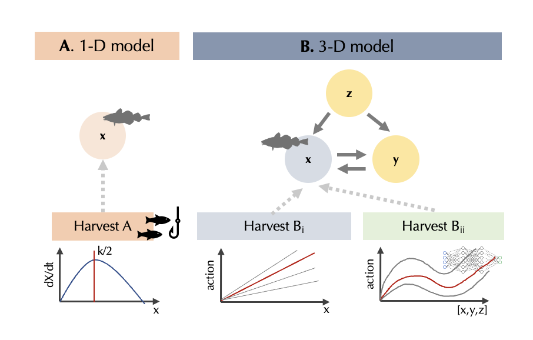

```{r knit_global, include=FALSE}
knitr::opts_chunk$set(cache = TRUE, echo = FALSE, message = FALSE, 
                      warning = FALSE, fig.height=5, fig.width=7.5)
library(tidyverse)
library(patchwork)
```

```{r}
# for best const mortality and best const escapement
msy_optimizer <- function(df) {
  df |> 
  group_by(action, rep) |>
  filter(t == max(t)) |> 
  group_by(action) |>
  summarise(mean_reward = mean(reward), sd = sd(reward)) |> 
  filter(mean_reward == max(mean_reward))
}
escapement_optimizer <- function(df) {
  df |> 
  group_by(escapement, rep) |>
  filter(t == max(t)) |> 
  group_by(escapement) |>
  summarise(mean_reward = mean(reward), sd = sd(reward)) |> 
  filter(mean_reward == max(mean_reward))
}

# Collect data (outsource to separate R script later TBD)
msy_df <- read_csv("../data/msy.csv.xz")
best_action <- msy_optimizer(msy_df)$action
escapement_df <- read_csv("../data/escapement.csv.xz", show_col_types = FALSE)
best_e <- escapement_optimizer(escapement_df)$escapement
ppo_df <- read_csv("../data/PPO200.csv.xz")

opt_escapement <- escapement_df |> filter(escapement == best_e)

# set up for plots:

msy_sim <- msy_df |>
    filter(action == best_action) |> 
    group_by(rep) |>
    pivot_longer(c("X", "Y", "Z"),
                names_to = "species", values_to = "abundance") |>
    mutate(abundance = abundance + 1, policy = "msy") # natural units, policy name

actions <- unique(msy_df$action)
i <- which.min(abs(actions - best_action* 0.8))
tac_sim <- msy_df |> 
    filter(action == actions[[i]]) |>
    pivot_longer(c("X", "Y", "Z"),
        names_to = "species", values_to = "abundance") |>
    mutate(abundance = abundance + 1, policy = "tac")

ppo_sim <- ppo_df |> 
    pivot_longer(c("X", "Y", "Z"),
        names_to = "species", values_to = "abundance") |>
    mutate(abundance = abundance + 1, policy = "ppo")

esc_sim_df <- escapement_df |> 
    pivot_longer(c("X", "Y", "Z"),
        names_to = "species", values_to = "abundance") |>
    mutate(abundance = abundance + 1)

msy_tac_ppo <- bind_rows(msy_sim, tac_sim, ppo_sim)
```

<!--
 Special Issue Description:

This special issue highlights the development of novel data-driven methods, including statistics, machine learning, parameter estimation, and uncertainty quantification, and combinations thereof, towards modeling biological systems. These newly developed methods will tackle challenges that are commonly encountered when modeling real-world experimental, field, pre-clinical, or clinical data. Examples of such challenges include high dimensionality, computational complexity, observation or process error, model bias, and intra- or inter-individual heterogeneity. Contributions to this special issue require validation of new methods with real-world data or simulated data sets that contain features of real-world data that exemplify an outlined modeling challenge. Papers should include a discussion justifying why the developed method is novel and not an application of previously developed methods, as well as how the method may be broadly applicable across different areas of biology, including medical, ecological, genetics, and epidemiological applications.
-->

# Introduction {#intro}

Much effort has been spent grappling with the complexity of our natural world in contrast to the relative simplicity of the models we use to understand it.
Heroic amounts of data and computation are being brought to bear on developing better, more realistic models of our environments and ecosystems, in hopes of improving our capacity to address the many planetary crises.
 But despite these efforts and advances, we remain faced with the difficult task of figuring out how best to respond to these crises.
While simplified models have historically allowed for exploration of large decision spaces,, the new wave of rich models are applied to highly oversimplified descriptions of potential actions they seek to inform.
For instance, Global Circulation Models (GCMs) such as HadOM3 [CITE] model earth's climate using 1.5M variables, while the comparably vast potential action space is modeled as one of six emissions scenarios from the IPCC [@riahi2017shared].

Even as our research community develops simulations of the natural world that fit only in supercomputers, we analyze a space of policies that would fit on index cards.
Similar combinations of rich process models and highly simplified decision models (often not even given the status of 'model') are common [e.g., CITE].
Modeling the potential action space as one of a handful of discrete scenarios is sometimes a well justified acknowledgement of the constraints faced by real-world decision-makers – particularly in the context of multilateral decisions –
and may seem to reflect a division of responsibilities between 'scientists' modeling the 'natural processes' and policy-makers who make the decisions.
But, more often, this simplification of decision choices is simply mathematically or conceptually convenient.  <!-- there are questions of policy scale hiding here -- e.g. local regulators of a specific industry obviously face a different action space than national legislatures or international diplomats -->
This simplification reflects trade-offs between tractablity and complexity at the basis of any mathematical modeling -- if we make both the state space and action space too realistic, the problem of finding the best sequence of actions quickly becomes intractable.
However, emerging data-driven methods from machine learning offer a new choice -- algorithms that can find good strategies in such problems, but at the cost of opacity.  

In this paper, we focus on a well-developed application of model-based management of the natural world that has long illustrated the trade-offs between model complexity and policy complexity: the management of marine fisheries.
Fisheries management is both an important issue to itself and a rich & frequent test-bed of ecological management more generally.
Fisheries are an essential natural resource that provide the primary source of protein for one in every four humans, and have faced widely documented declines due to over-fishing [@Worm2006, @Costello2016].
Fisheries management has  roots in both the fields of _ecosystem management_ and _natural resource economics_.
Both fields might trace their origins to the notion of maximum sustainable yield (MSY), introduced independently by a fisheries ecologist [@Schaefer1954] and the economist [@Gordon1954] in the same year.
From this shared origin, each field would depart from the simplifying assumptions of the Gordon-Schaefer model in divergent ways, leading to different techniques for deriving policies from models.The heart of the management problem is easily understood: a manager seeks to set quotas on fishing that will ensure the long-term profitability and sustainability of the industry.
Mathematical approaches developed over the past century may be roughly divided between these two fields: (A), ecologists, focused on ever more realistic models of the biological processes of growth and recruitment of fish while considering relatively stylized suite of potential management strategies, and (B) economists, focused on far more stylized models of the ecology while exploring a far less constrained set of possible policies.
The economist's approach can be characterized by the mathematics of a Markov decision process [MDP @Clark1973; @Clark1990; @Marescot2013], in which the decision-maker must observe the stock each year and recommend a possible action.
In this approach, the policy space that must be searched is exponentially large -- for a management horizon of T decisions and a space of N actions, the number of possible policies is N^T.
In contrast, fisheries ecologists and ecosystem management typically search a space of policies that does not scale with the time horizon.
Under methods such as "Management Strategy Evaluation" (MSE, [@Punt2016]) a manager identifies a candidate set of "strategies" a priori, and then compares the performance of each strategy over a suite of simulations to determine which strategy gives the best outcome (i.e. best expected utility).
This approach is far more amenable to complex simulations of fisheries dynamics and more closely corresponds to how most marine fishing quotas are managed today in the United States [see stock assessments documented in @RAMLegacyDB].
<!-- Do we say here that these strategies retain the 'constant mortality' intuition of @Schaefer? -->

Recent advances in machine learning may allow us to once again bridge these approaches, while also bringing new challenges of their own.
Novel data-driven methods have allowed these models to evolve into ever more complex and realistic simulations used in fisheries management, where models with over 100 parameters are not uncommon [@RAMLegacyDB].
Constrained by computational limits, MDP approaches have been intractable on suitably realistic models and largely confined to more academic applications [@Costello2016].
However, advances _Deep Reinforcement Learning_, (DRL) a sub-field of machine learning, have recently demonstrated remarkable performance in a range of such MDP problems, from video games [@atari1; @atari2] to fusion reactions [@fusion1; @fusion2] to the remarkable dialog abilities of ChatGPT [@chatgpt].
RL methods also bring many challenges of their own: being notoriously difficult to train and evaluate, immense computational costs, and frequent challenges with transfer-ability or reproducibility.
A review of all these issues is beyond our scope but can be found elsewhere [@rl_intro; @millie-1; @millie-2].
Here, though, we will focus on the issue of opacity and interpretability raised by these methods.
In contrast with optimization algorithms currently used in either ecosystem management or resource economics, RL algorithms have no guarantees of or metrics for convergence to an optimal solution.
In general, one can only assess the performance of these black box methods relative to alternatives.

<!--NEED some kind of map paragraph here saying what's ahead, what we show  -->
In this article, we compare the performance of a DRL solution to that of a management strategy evaluation across potential 'constant mortality' policies.\footnote{A repository with all the relevant code to reproduce our results may be found at \url{https://github.com/boettiger-lab/approx-model-or-approx-soln} in the ‘‘code’’ subdirectory. The data used is found in the ‘‘data’’ subdirectory, but the user may use the code provided to generate new data sets.} 
We consider the problem of devising harvest strategies in a three species ecosystem (Figure 1B).
We show that, somewhat surprisingly, the DRL policy closely resembles a *bang-bang* solution (see Text Box 1).
Bang-bang solutions are known to be optimal for a variety of single-species models, however, there is no a-priori reason why they should be optimal for higher-dimensional systems.
The DRL policy drives an oscillation process in the system and, in this way, maintains the long-term sustainability of fishing.
In contrast, constant mortality policies overfish at low populations and underfish (relative to the DRL solution) at high populations.
This leads to a tradeoff when leveraging constant mortality strategies: higher constant mortality rates lead to high profitability at the expense of a higher probability of overfishing to extinction, while lower constant mortality rates attain stability at the expense of profit.

The DRL approach side-steps this tradeoff by optimizing over a more complex family of possible policies—policies parametrized by a neural network, as opposed to policies labeled by a single parameter (the mortality rate).
We thus observe that the DRL solution leads to a higher profitability *and* stability as compared to constant mortality policies. 

```{r}
#| label: conceptual
#| echo: FALSE
#| message: FALSE
#| fig.align: 'center'
#| fig.cap:  '(A) Classical management strategies are often derived by reducing the complex dynamics of the fishery ecosystem to a single equation governing the harvested population (say, $X$). where the interaction between $X$ and its environment is summarized to a set of parameters, such as the growth rate $r$, and the carrying capacity $K$. An advantage of one-dimensional approaches is that the optimal policy is often known exactly, and, moreover, is intuitive. For example, in the logistic equation shown, the maximal sustainable yield of the system is attained at K/2. 
#| (B) In contrast to this, we study the problem of managing a three species fishery, where we harvest species $X$.
#| In addition to $X$, there is a species $Y$ which competes with $X$ for resources, and a species $Z$ which preys on $X$ and $Y$.
#| We compare two approaches solving harvest strategies in this system. 
#| The first (Harvest $B_{\mathrm{i}}$) is based on the intuition obtained from 1D control: we use simulated data to empirically determine which constant mortality policy is optimal for controlling this fishery.
#| The second (Harvest $B_{\mathrm{ii}}$) is an RL policy, where the policy function is expressed as a neural network and the algorithm uses a variant of \emph{gradient ascent} (namely, \emph{Proximal Policy Optimizaton (PPO)}) to optimize this network.
#| Both approaches we compare are \emph{model-free:} the optimization algorithm treats the model as a black box, only using its input-output statistics.
#| This way, the optimal policy is not computed from the values of the model parameters, but rather by comparing how policies perform in controlling the system.'
#| out.width: '6.5in' 
#| fig.pos: 'H'
 

```

# Mathematical models of fisheries

In this section we introduce some models describing the population dynamics of fisheries.
In general, the class of models that appear in this context are *first order finite difference equations* (potentially stochastic difference equations).
For $n$ species, these models have the general form
\begin{align}
  \label{eq:general model}
  \begin{split}
    \Delta X_t &:= X_{t+1} - X_t = f_X(N_t) - M_X X_t\\
    \Delta Y_t &:= X_{t+1} - Y_t = f_Y(N_t) - M_Y Y_t\\
    &\dots
  \end{split}
\end{align}
where $N_t = (X_t,\ Y_t,\ \dots) \in \mathbb{R}^{n}_+$ is a vector of populations and $f_i:\mathbb{R}^{n}\to\mathbb{R}$ are arbitrary functions.
Here, $M_i=M_i(N_t)\in\mathbb{R}_+$ is a state-dependent fish mortality arising from harvesting (sometimes referred to as *fishing effort*).
Thus, the term $M_X X_t$ is the total $X$ harvest at time $t$.
We will focus on systems where a single species, $X$ is harvested, i.e. $M_Y = M_Z = \dots = 0$.

## A single species model

Optimal control policies for fisheries are frequently based on 1-dimensional models, $n=1$, as described in $Text$ $Box$ $1$.
The most familiar model of $f(X)$ is that of *logistic growth*, for which

\begin{align}
  \label{eq:logistic}
  f(X_t) = r X_t\big(1 - X_t / K \big) =: L(X_t;\ r, K).
\end{align}


Real world ecological systems are obviously far more complicated than this simple model suggests.
One particularly important aspect that has garnered much attention is the potential for the kind of highly non-linear functions that can support dynamics such as alternative stable states and hysteresis.
A seminal example of such dynamics was introduced in [@may77], using a one-dimensional model of a prey (resource) species under the pressure of a (fixed) predator:

\begin{align}
  \label{eq:may}
  f_{\text{May}}(X_t)
  := L(X_t;\ r, K) - F(X_t, H; \beta,c),
\end{align}
where,
\begin{align*}
  F(X_t,H;\ \beta,c) := \frac{\beta H X_t^2}{c^2 + X_t^2}.
\end{align*}

The model has five parameters: the growth rate $r$ and carrying capacity $K$ for $X$, a constant population $H$ of a species which preys on $X$, the maximal rate of predation $\beta$, and the predation half-maximum biomass $c$.

Eq. \eqref{eq:may} is an interesting study case of a *tipping point* (saddle-node bifurcation) (see Fig. \ref{fig:may}).
Holding the value of $\beta$ fixed, for intermediate values of $H$ there exist two stable fixed points for the state $\hat X_t$ of the system, these two attractors separated by an unstable fixed point.
At a certain threshold value of $H$, however, the top stable fixed point collides with the unstable fixed point and both are annihilated.
For this value of $H$, and for higher values, only the lower fixed point remains.
This also creates the phenomenon of *hysteresis*, where returning $H$ to its original value is not sufficient to restore $\hat X_t$ to the original stable state. 

```{r}
#| label: may
#| fig.cap: "The fixed point diagram for the model associated to $f_{\\text{May}}$ as a function of varying the parameter $\\beta H$.
#| That is, these are the zeroes of the function $f_{\\text{May}}$. 
#| Stable fixed points (also known as *attractors*) are plotted using a solid line, while the unstable fixed point is shown as a dotted line."
#| out.width: "6.5in"

knitr::include_graphics("figures/MayStablePoints.pdf")
```

This structure implies two things.
First, that a drift in $H$ could lead to catastrophic consequences, with the population $X_t$ plummeting to the lower fixed stable point.
Second, that if the evolution of $X_t$ is *stochastic*, then, even at values of $H$ below the threshold point, the system runs a sizeable danger of tipping over towards the lower stable point.


<!-- Discuss control solutions of this model(?) -->
<!-- Briefly motivate reason to consider 3d model, adding competition and predation processes -->


## A three species model

Consider the following three species *generalization* of eq. \eqref{eq:may}:

\begin{align}
\label{eq:3d model}
\begin{split}
  \Delta X_t &= L(X_t;\ r_X, K_X) - F(X_t, Z_t;\ \beta, c) - c_{XY}X_tY_t - h_t,\\
  \Delta Y_t &= L(Y_t;\ r_Y, K_Y) - D F(Y_t, Z_t;\ \beta, c) - c_{XY}X_tY_t,\\
  \Delta Z_t &= \left(f(X_t + DY_t\right) - d_Z)Z_t.
\end{split}
\end{align}
The model is conceptualized in Fig. \ref{fig:conceptual}, panel B.
It contains three populations, the state at time $t$ is $(X_t, Y_t, Z_t)$. 
Species $Z$ preys on both $X$ and $Y$, while the latter two compete for resources.
There are ten parameters in this model: 
The growth rate and carrying capacity, $r_X$, $K_X$, $r_Y$ and $K_Y$, of $X$ and $Y$.
A parameter $c_{XY}$ mediating a Lotka-Volterra competition between $X$ and $Y$.
A maximum hunting intensity $\beta$ and half-maximum $c$ specifying how $Z$ forages on $X$ and $Y$.
A parameter $D$ regulating a relative preference of $Z$ to prey on $Y$.
Finally, a death rate $d_Z$ and a parameter $f$ related to the birth rate of $Z$.

This model generalizes eq. \eqref{eq:may} in the following sense:
If $f=d_Z=c_{XY}=0$, and we let $Z_{t=0}=H$, then eq. \eqref{eq:3d model} becomes
\begin{align*}
  \Delta X_t &= L(X_t;\ r_X, K_X) - F(X_t, H;\ \beta, c) - h_t,\\
  \Delta Y_t &= L(Y_t;\ r_Y, K_Y) - D F(Y_t, H;\ \beta, c),\\
  Z_t &= H.
\end{align*}
The equations for $X_t$ and $Y_t$ thus become decoupled, with $X_t$ evolving according to \eqref{eq:may}.

As can be expected, the dynamics of eq. \eqref{eq:3d model} are significantly more complex than those of eq. \eqref{eq:may}.
There are a variety of fixed points for the equations---around 8 or 9 for wide ranges of parameter values.
Fig. \ref{fig:fixed points} provides a rough idea of the fixed point structure by plotting the bifurcation diagram obtained from varying $D$ and fixing the other parameters.

\begin{figure}
  \centering
  \begin{subfigure}[b]{0.32\textwidth}
    \centering
    \includegraphics[width=\textwidth]{figures/stX.png}
    \caption{$X$ component of fixed points.}
    \label{fig:stx}
  \end{subfigure}
  \hfill
  \begin{subfigure}[b]{0.32\textwidth}
    \centering
    \includegraphics[width=\textwidth]{figures/stY.png}
    \caption{$Y$ component of fixed points.}
    \label{fig:sty}
  \end{subfigure}
  \hfill
  \begin{subfigure}[b]{0.32\textwidth}
    \centering
    \includegraphics[width=\textwidth]{figures/stZ.png}
    \caption{$Z$ component of fixed points.}
    \label{fig:stz}
  \end{subfigure}
  \caption{Numerically-computed fixed points of the three-species deterministic model, eq. \eqref{eq:3d model}.
  Here, the parameter $D$ was varied between 0.75 and 1.25, and the three components of the fixed points are plotted separately, as a function of $D$.}
  \label{fig:fixed points}
\end{figure}

Throughout most of this paper we will fix the parameters of the model according to eq. \eqref{eq:param vals}.
At these values, the fixed points of the model are:\footnote{
We have included only three decimal digits for readability.
These fixed points may be generated by running the ‘‘stable\_points.py’’ script in \url{https://github.com/boettiger-lab/approx-model-or-approx-soln}.
}
\begin{align*}
  (X,Y,Z) \approx &(0.839, 0.054, 0.377), \quad 
    (0.048, 0.774, 0.480), \quad
    (0.359, 0.491, 0.509), \\
    &(0.666, 0.666, 0.000),\quad
    (0.899, 0.000, 0.303), \quad
    (0.000, 0.818, 0.457), \\
    &(1.000,0.000,0.000),\quad (0.000,1.000,0.000),\quad (0.000,0.000,0.000).
\end{align*}
The classification of fixed points for multi-dimensional systems is generally more complicated than in one dimension.
A fixed point might be stable against perturbations in one direction, but unstable against perturbations along another.
While a detailed classification of these fixed points is beyond the scope of this work, we point out that the point $(0.839, 0.054, 0.377)$ is stable against perturbations in all directions.
We will thus use it as a starting point for our simulations.

## Stochastic dynamics

We have, up to now, presented eqs. \eqref{eq:may} and \eqref{eq:3d model} as *deterministic* dynamical models for the sake of clarity.
In practice, we will consider a stochastic contribution to these dynamics.
This way, instead of eq. \eqref{eq:may}, we consider the following stochastic single-species system
\begin{align}
  \label{eq:may stoch}
  \Delta X_t
  = L(X_t;\ r, K) - F(X_t, H; \beta,c) - h_t + \eta_t,
\end{align}
where $\{\eta_t\}_t$ are independent Gaussian variables with zero mean.
The variance $\sigma^2$ of $\eta_t$ is an additional parameter of the model.

Similarly, we use the following dynamical model in place of eq. \eqref{eq:3d model}
\begin{align}
  \label{eq:3d model stoch}
  \begin{split}
    \Delta X_t &= L(X_t;\ r_X, K_X) - F(X_t, Z_t;\ \beta, c) - c_{XY}X_tY_t - h_t + \eta_{X,t},\\
    \Delta Y_t &= L(Y_t;\ r_Y, K_Y) - D F(Y_t, Z_t;\ \beta, c) - c_{XY}X_tY_t + \eta_{Y,t},\\
    \Delta Z_t &= \left(f(X_t + DY_t\right) - d_Z)Z_t + \eta_{Z,t}.
\end{split}
\end{align}
Here, again, $\{\eta_{i,t}\}$ is a set of independent Gaussian variables centered at zero with variances, respectively, $\sigma_X^2$, $\sigma_Y^2$ and $\sigma_Z^2$.


```{r}
msy_rewards <- msy_df |>
  group_by(action, rep) |>
  filter(t == max(t)) |> 
  group_by(action) |>
  summarise(mean_reward = mean(reward),
            sd = sd(reward)) 

esc_rewards <- escapement_df |>
  group_by(escapement, rep) |>
  filter(t == max(t)) |> 
  group_by(escapement) |>
  summarise(mean_reward = mean(reward),
            sd = sd(reward))

rmsy <- msy_rewards |>
  ggplot(aes(action, mean_reward, 
             ymin = mean_reward - 2*sd,
             ymax=mean_reward+2*sd)) +
  geom_point() + geom_ribbon(alpha=0.4) +
  labs(y = "episode reward", x = "constant mortality") +
  theme(aspect.ratio = 1/1) + 
  geom_vline(aes(xintercept=0.0360), color="red") + 
  geom_vline(aes(xintercept=0.0288), color="green") 

resc <- esc_rewards |>
  ggplot(aes(esc_level, mean_reward, 
             ymin = mean_reward - 2*sd,
             ymax=mean_reward+2*sd)) +
  geom_point() + geom_ribbon(alpha=0.4) +
  labs(y = "episode reward", x = "constant escapement") +
  theme(aspect.ratio = 1/1)

# (rmsy | resc)
```


# Reinforcement learning {#sec:RL}

Reinforcement learning (RL) is a way of approaching *sequential decision problems* through machine learning.
All applications of RL can be conceptually separated into two parts: an *agent* and an *environment* which the agent interacts with.
That is, the agent takes actions within the environment.
As a result of an agent's action, the environment will transition to a new state and return a numerical *reward* to the agent.\footnote{See Fig. TBD in [@rl-intro-marcus] for a conceptual description of reinforcement learning algorithms.}
The rewards encode the agent's goal.
The main task of any RL algorithm is then to maximize the cumulative reward received. 
This objective is achieved by aggregating experience in what is called the *training* period and learning from such experience.
<!-- ML: We could cite our deep RL paper here instead of going into further details. Not sure what we are expecting as the audience. -->.

<!-- The *environment* is commonly a computer simulation, although it sometimes can be a real world system.
The *agent*, on the other hand, is a computer program which interacts with the environment. -->

For our use case, the environment will be a computational model of the population dynamics of a fishery, with the environment state being a vector of all the fish populations, $S=(V_1, V_2, H)$.
At each time step, the agent harvests one of the populations, $V_1$. 
This changes the state as
\begin{align*}
  (V_1,\ V_2,\ H) \mapsto ((1-q)V_1,\ V_2,\ H),
\end{align*}
where $q$ is a fishing *quota* set by the agent. 
This secures a reward of $qV_1$.
Afterwards, the environment undergoes a timestep under its natural dynamics given by \eqref{eq:3d model}.

## Mathematical framework for RL

The RL environment can be formally described as a discrete time *partially observable Markov decision process (POMDP)*.
This formalization is rather flexible and allows one, e.g., to account for situations where the agent may not fully observe the environment state, or where the only observations available to the agent are certain functions of the underlying state.
For the sake of clarity, we will only present here the class of POMDPs which are relevant to our work: *fully observable MDPs with a trivial emission function* (henceforth MDPs for short).
An MDP may be defined by the following data:

- $\mathcal{S}$: *state space*, the set of states of the environment,

- $\mathcal{A}$: *action space*, the set of actions which the agent may choose from,

- $T(s_{t+1}|s_t, a_t)$: *transition operator*, a conditional distribution which describes the dynamics of the system,

- $r(s_t, a_t)$: *reward function*, the reward obtained after performing action $a_t\in\mathcal{A}$ in state $s_t$,

- $d(s_0)$: *initial state distribution*, the initial state of the environment is sampled from this distribution,

- $\gamma\in[0,1]$: *discount factor*.

At a time $t$, the MDP agent observes the full state $s_t$ of the environment and chooses an action based on this observation according to a *policy function* $\pi(a_t | s_t)$.
In return, it receives a discounted reward $\gamma^t r(a_t, s_t)$.
The discount factor helps regularize the agent, helping the optimization algorithm find solutions which pay off within a timescale of $t \sim \log(\gamma^{-1})^{-1}$.

With any fixed policy function, the agent will traverse a path 
$\tau=(s_0,\ a_0,\ s_1,\ a_1\ \dots,\ s_{t_{\text{fin.}}})$ 
sampled randomly from the distribution
\begin{align*}
  p_\pi(\tau) = 
  d(s_0) \prod_{t=0}^{ t_{\text{fin.}}-1 }
  \pi( a_t | s_t ) T( s_{t+1} | s_t, a_t ).
\end{align*}
Reinforcement learning seeks to optimize $\pi$ such that the expected rewards are maximal,
$$  
  \pi^* = \mathrm{argmax}\ \mathbb{E}_{\tau\sim p_\pi}[R(\tau)],
$$
where,
$$
  R(\tau) = \sum_{t=0}^{ t_{\text{fin.}}-1 } \gamma^t r(a_t, s_t),
$$
is the cumulative reward of path $\tau$.
The function $J(\pi):=\mathbb{E}_{\tau\sim p_\pi}[R(\tau)]$ is called the *expected return*.

## Deep Reinforcement Learning

The policy function $\pi$ often lives in a high or even infinite-dimensional space.
This makes it unfeasible to directly optimize $\pi$.
In practice, an alternative approach is used: $\pi$ is optimized over a much lower-dimensional parameterized family of functions. <!-- ML: I am not following this line of thought here. I see the main reason why NN's are used as being that NN's are universal function approximators, and we don't know what the policy and/or value function will look like.

FM: my take here is that the space of functions from states to actions is in principle infinite-dimensional or at least very high dimensional. (e.g. exponentially high dimensional in terms of the number of degrees of freedom in state space, for the case of discretized state spaces).
By restricting our ansatz to neural networks of a fixed depth/breadth, we're restricting ourselves to a finite dimensional (or, in the discrete case, potentially much lower dimensional) manifold of policies over which gradient descent may be performed much more efficiently.
E.g. the dimensionality of the space we're searching for is determined by the size of the neural network, it's finite dimensional for continuous state spaces, and its dimension is not necessarily exponential in the number of species.
-->
Deep reinforcement learning uses this strategy, focusing on function families parameterized by neural networks. (See Fig. 1 and App. A in [@rl-intro] for a conceptual introduction to the use of reinforcement learning in the context of conservation decision making.)
<!--(See Fig. \ref{tbd}.)-->
<!-- The figure should kinda explain how the parametrization arises, and how gradient ascent is used. Maybe namedrop backpropagataion for the sake of usefulness to the reader? -->


Since our state and observation spaces are continuous, we will focus on deep reinforcement learning throughout this paper.
Within the RL literature there is a wealth of algorithms from which to choose from to optimize $\pi$, each with its pros and cons.
Most, if not all, of these are based on gradient ascent by using the technique of *back-propagation* to efficiently compute the gradient.
Here we have used only one such algorithm (*proximal policy optimization (PPO)*) for the sake of particularity---to draw a clear comparison between the RL-based and the classical fishery management approaches.
In practice, further improvements can be expected by a careful selection of the optimization algorithm. 
(See, e.g., [@franccois2018introduction] for an overview of different optimization schemes used in DRL.)

## Model-free reinforcement learning

Within control theory, the classical setup is one where we use as much information from the model as possible in order to derive an optimal solution.
Here, one may find a vast literature on model-based methods to attain optimal, or near-optimal, control (see, e.g., [@zhang2019near; @sethi2019optimal; @anderson2007optimal]).

The classical sustainable fishery management approaches summarized in Text Box 1, for instance, are model-based controls.
As we saw there, these controls may run into trouble in the case where there are inaccuracies in the model parameter estimates.

There are many situations, however, in which the exact model of the system is not known or not tractable.
This is a standard situation in ecology: mathematical models capture the most prominent aspects of the ecosystem's dynamics, while ignoring or summarizing most of its complexity.
In this case, it is clear, model-based controls run a grave danger of mismanaging the system.

Reinforcement learning, on the other hand, can provide a model-free approach to control theory.
While a model is often used to generate training data, this model is not directly used by model-free RL algorithms.
This provides more flexibility to use RL in instances where the model of the system is not accurately known.
In fact, it has been shown that model-free RL outperforms model-based alternatives in such instances [@mbpo].
(For recent surveys of model-based reinforcement learning, which we do not focus on here, see [@moerland2023model; @polydoros2017survey].)

This context provides a motivation for this paper. 
Indeed, models for ecosystem dynamics are only ever approximate and incomplete descriptions of reality. 
This way, it is plausible that model-free RL controls outperform currently used model-based controls in ecological management problems.


# Methods

\textbf{Training a DRL agent.}
We trained a DRL agent parametrized by a neural network $\theta$ with two hidden, 64-neuron, layers.
The state space used was a cube $[0,2]^{\times 3}$, while the policies explored mapped states $N_t$ to a single number, $h_t = \pi_\theta(N_t)$, the harvest quota on species $X$ at that timestep.
Each episode in the training and in the evaluation stages was at most 200 time steps long.
Episodes were ended early in case of a ‘‘near-extinction event,’’ a moment in which any of the populations dipped below a threshold value, i.e.,
\begin{align}
  \label{eq:thresh}
  X_t \leq X_{\text{thresh.}},\quad
  Y_t \leq Y_{\text{thresh.}},\quad
  \text{or,}\quad
  Z \leq Z_{\text{thresh.}}.
\end{align}
The reward function had two componenets:
First, at each time step the harvest $h_t$ was received as a reward.
Second, if the episode ended early (say, at time-step $t$) because of a near-extinction event, a negative reward of $-50/t$ was awarded.
The constant 50 was chosen so as to select against highly extractive policies in the early stages of training, and thus guide the agent towards sustainable policies.
This technique, falling under the ‘‘umbrella’’ category of *reward shaping*, is commonly used -- alongside hyper-parameter tuning and state space normalization -- to improve the speed of training by avoiding badly-performing local optima in the gradient ascent algorithm.

Thus, we normalized state space (to be contained in a cube of length 2) and engaged in reward shaping in order to optimize our agent's learning.
We did not need to tune hyper-parameters for this goal, however.

We used the Ray framework\footnote{\url{https://docs.ray.io/}} for training, in particular we used a Ray PPOConfig object to build the algorithm using the default values for all hyper-parameters.
The agent was trained for 200 iterations of the PPO optimization step.

\textbf{Tuning the constant mortality strategy.}
A grid of 100 mortality rates was laid in the interval $[0, 0.1]$.
For each one of these rates, say $M$, we simulated 50 episodes based on \eqref{eq:3d model stoch}:
At each time step the state $(X_t, Y_t, Z_t)$ was observed, a harvest of $MX_t$ was collected and then the system evolved according to its natural dynamics \eqref{eq:3d model stoch}.
The optimal mortality rate was the value $M^*$ for which the mean episode reward was maximal.
We additionally evaluated a more conservative strategy where a mortality of $0.8 M^*$ instead is used.

The result of the tuning procedure is shown in Fig. \ref{fig:tuning}. 
There, we see that the optimal value $M^*$ lies in an area with high episode reward variance.
We will see in Fig. \ref{fig:rew_len_fig} that a likely candidate for this variance is the presence of episodes with early endings.
Thus, the value $0.8 M^*$ supports a smaller variance, and correspondingly -- as Fig. \ref{fig:rew_len_fig} shows -- this policy leads to a much smaller probability of a near-extinction event.

```{r}
#| label: tuning
#| fig.cap : "Result of the tuning procedure for the constant mortality strategy. 
#| (A) Mean episode reward (averaged over 50 episodes) shown as scatter data, and shaded in gray are two standard deviations around each scatter point. Vertical lines correspond to the optimal constant mortality rate $M^* = $ 0.045 (green) and $0.8 M^*=$ 0.036 (violet). 
#| (B) Several constant mortality policies shown for illustrative purposes. Slopes $0.02$, $0.03$, $0.055$ and $0.065$ shown in black; the optimal linear policy $M^*X$ shown in green, while $0.8M^*X$ shown in violet. (TBD choose nicer and plentier  slopes)" 
#| out.width : "6.5in"
msy_rewards <- msy_df |>
  group_by(action, rep) |>
  filter(t == max(t)) |> 
  group_by(action) |>
  summarise(mean_reward = mean(reward),
            sd = sd(reward))

rmsy <- msy_rewards |>
  ggplot(aes(action, mean_reward, 
             ymin = mean_reward - 2*sd,
             ymax=mean_reward+2*sd)) +
  geom_point() + geom_ribbon(alpha=0.4) +
  labs(y = "episode reward", x = "constant mortality") +
  theme(aspect.ratio = 1/1) + 
  geom_vline(aes(xintercept=best_action), color="seagreen3", size=1) + 
  geom_vline(aes(xintercept=0.8*best_action), color="violetred3", size=1) +
  theme_bw() + 
  theme(panel.grid.major = element_blank(), 
        panel.grid.minor = element_blank(),
        aspect.ratio = 1) 

# linear function blueprint
linear_f <- function(slope, x) slope*x
# generates linear function with given slope
linear_f_gen <- function(slope) (function(x) slope*x)

# dummy data set to keep ggplot happy
p <- ggplot(data = data.frame(x = 0), mapping = aes(x = x))

# p + stat_function(fun = linear_f_gen(0.5)) + xlim(0,2)
lines <- p + stat_function(fun = linear_f_gen(0.009)) + 
  stat_function(fun = linear_f_gen(0.018)) +
  stat_function(fun = linear_f_gen(0.027)) +
  stat_function(fun = linear_f_gen(0.8*best_action), col = "violetred3", size=1) +
  stat_function(fun = linear_f_gen(best_action), col = "seagreen3", size=1) +
  stat_function(fun = linear_f_gen(0.054)) + 
  stat_function(fun = linear_f_gen(0.063)) +
  stat_function(fun = linear_f_gen(0.072)) +
  stat_function(fun = linear_f_gen(0.081)) +
  stat_function(fun = linear_f_gen(0.090)) +
  xlim(0,2) +
  xlab("X") + ylab("harvest") +
  theme_bw() +
  theme(panel.grid.major = element_blank(), 
        panel.grid.minor = element_blank(), 
        aspect.ratio = 1)


(rmsy | lines) + plot_annotation(tag_levels = c('A'))
```

\textbf{Parameter values used.}
The model's dynamic parameters were chosen as follows
\begin{align}
\label{eq:param vals}
\begin{split}
  r_X = K_X = r_Y = K_Y = 1, \quad \beta = 0.3, \quad c = 0.1\\
  c_{XY} = 0.5,\quad f = 0.15,\quad D = 1.1, \quad d_Z = 0.135.
\end{split}
\end{align}
Moreover, the variances for the stochastic terms were chosen as
$$
  \sigma^2(\eta_{X,t}) = \sigma^2(\eta_{Y,t}) = \sigma^2(\eta_{Z,t}) = 0.05.
$$
The threshold values used to determine an early episode end were chosen as
$$
  X_{\text{thresh.}} = 0.08,\quad Y_{\text{thresh.}} = Z_{\text{thresh.}} = 10^{-4},
$$
where the higher value of $X_{\text{thresh.}}$ helped select for more sustainable fishing strategies (for both the DRL and constant mortality approaches).

# Results

We evaluated each of the three control approaches (MSY constant mortality, 80% MSY constant mortality and DRL) by running 50 episodes using the respective control rule.
In Fig. \ref{fig:timeseries} we show the time series of one such repetition.
The left panel uses an MSY constant mortality control $M^*X$, the middle panel uses $0.8 M^* X$, while the right panel is controlled by the trained DRL agent.
We see that that optimal constant mortality control leads to a near-extinction event at around $t=150$.
The constant mortality policy at $0.8 M^*$ is already conservative enough to support a sustainable path.
There, the population levels are maintained roughly in a stationary state.
Finally, the DRL time series shows an oscillatory behavior, with a slight dephase between the $Y$ and $Z$ curves, while the $X$ oscillations are roughly anticorrelated with $Z$.

```{r} 
#| label: timeseries 
#| fig.cap: "A sample time series for the three fish populations, with the system being controlled, respectively, by the MSY optimal mortality, by $80$ percent of the MSY optimal mortality, and by DRL." 
#| out.width: "6.5in"
policy_labels <- list("msy" = "MSY Const. Mortality", "tac"= "80% MSY Const. Mortality", "ppo"= "DRL")
policy_labeller <- function(variable,value){
  return(policy_labels[value])
}
msy_tac_ppo |> 
    group_by(rep, policy) |>
    filter(rep == 6) |>
    ggplot(aes(t, abundance, col = species)) + 
        geom_line()  + 
        scale_color_manual(values=c('palegreen3', 'coral1', 'deepskyblue4')) +
        facet_wrap(~factor(policy, levels = c("msy", "tac", "ppo")), labeller = policy_labeller ) +
        labs(y = "abundance", x = "time") +
        theme_bw() +
        theme(aspect.ratio = 2/3)
```

This time series is representative of the patterns observed in the data (see App. A.1).
The episode reward and episode length statistics are shown in Fig. \ref{fig:rew_len_fig}.
There, we highlight two things:
First, that the tendency towards early episode ends is fixed by the conservative approach of fishing at 80% of the MSY mortality rate.
(In App. A.2 we discuss and evaluate other policies using a fixed-percentage of the MSY mortality rate.)
Second, that while the conservative 80% approach has a stable behavior, it consistently produces smaller harvests than a DRL generated policy.

```{r} 
#| label: rew_len_fig
#| fig.cap: "Bar charts for the episode lengths (top panel) and episode total harvests (bottom panel) for 50 episodes." 
#| out.width: "6.5in"
p1 <- msy_tac_ppo |> 
    group_by(rep, policy) |>
    filter(t==max(t), species == "X", rep < 50) |>
    ggplot(aes(rep, t)) + 
      geom_col() +
      facet_wrap(~factor(policy, levels = c("msy", "tac", "ppo")), labeller = policy_labeller ) +
      labs(y = "episode length", x = "repetition") +
      theme_bw() + 
      theme(axis.text.x = element_blank())

p2 <- msy_tac_ppo |> 
    group_by(rep, policy) |>
    filter(t==max(t), species == "X", rep < 50) |>
    ggplot(aes(rep, reward)) + 
      geom_col() +
      facet_wrap(~factor(policy, levels = c("msy", "tac", "ppo")), labeller = policy_labeller ) +
      labs(y = "episode harvest", x = "repetition") +
      theme_bw() + 
      theme(axis.text.x = element_blank())

(p1 / p2) + plot_annotation(tag_levels = 'A')
```

To understand the DRL-derived policy, Fig. \ref{fig:action-X} depicts the harvest as a function of $X$.
Specifically, for each point $(x,y,z)$ visited by one of the aforementioned 50 evaluation episodes, we evaluate the harvest collected by the DRL agent and we subsequently plot the scatter data as a function of the projection $x$ onto the $X$ axis.
In panel A we have used color to add the a $Y$-dependence, while in panel B we did the same with $Z$-dependence.
This shows that the $Z$ and $Y$ dependence of the policy is rather weak and in fact it has roughly the same shape as an escapement policy.

Fig. \ref{fig:action-X} additionally shows (pink line) the optimal constant escapement policy and the MSY constant mortality policy (green line).
The optimal constant escapement was computed in a manner similar to how the MSY constant mortality was computed: for each escapement in a grid of 100 values between 0 and 1, 50 episodes were run using the corresponding escapement policy.
The value with the best mean episode reward was chosen as the optimal escapement value.
We observe that the DRL policy approximates the optimal constant escapement policy, with the difference of being more conservative in its harvest at high $X$ values.
This pattern can be seen in panels (C-D), where at high $X$ values, the DRL escapement mildly increases in a non-linear fashion rather than staying constant.
Finally, relative to these two policies, we observe that MSY constant mortality underfishes at high $X$ values and overfishes at low $X$ values.

```{r}
#| label: action-X
#| fig.cap: "(A-B) Harvest and escapement scatter data for the DRL policy together with the optimal constant escapement (pink) and constant mortality (green) policies for comparison. 
#| (A) includes $Y$ dependence through color, whereas (B) includes $Z$ dependence similarly.
#| (B-C) escapement (i.e. $X_t - h_t$) scatter data for the DRL policy. 
#| Optimal constant escapement policy shown in pink for comparison."
#| out.width: "6.5in"
opt_escapement_harvest <- function(X) case_when(
  X > best_e ~ X - best_e,
  X <= best_e ~ 0
)

opt_escapement_escapement <- function(X) case_when(
  X <= best_e ~ X,
  X > best_e ~ best_e
)

msy_harvest <- function(X) best_action*X
tac_harvest <- function(X) 0.8*msy_harvest(X)

py <- ppo_df |>
  mutate(X = X+1, Y = Y+1, Z = Z+1, harvest = action*X) |>
  ggplot(aes(X, harvest, color = Y)) +
  geom_point() +
  theme_bw() + 
  theme(aspect.ratio = 1/1) +
  stat_function(fun = opt_escapement_harvest, col = 'deeppink', size = 0.7) + 
  stat_function(fun = msy_harvest, col = 'seagreen2', size = 0.7)

pz <- ppo_df |>
  mutate(X = X+1, Y = Y+1, Z = Z+1, harvest = action*X) |>
  ggplot(aes(X, harvest, color = Z)) +
  geom_point() +
  theme_bw() + 
  theme(aspect.ratio = 1/1) +
  stat_function(fun = opt_escapement_harvest, col = 'deeppink', size = 0.7) + 
  stat_function(fun = msy_harvest, col = 'seagreen2', size = 0.7)

escxy <- ppo_df |>
  mutate(X = X+1, Y = Y+1, Z = Z+1, escapement = (1-action)*X) |>
  ggplot(aes(X, escapement, color = Y)) +
  geom_point() +
  theme_bw() + 
  theme(aspect.ratio = 1/1) +
  stat_function(fun = opt_escapement_escapement, col = 'deeppink', size = 0.7)

escxz <- ppo_df |>
  mutate(X = X+1, Y = Y+1, Z = Z+1, escapement = (1-action)*X) |>
  ggplot(aes(X, escapement, color = Z)) +
  geom_point() +
  theme_bw() + 
  theme(aspect.ratio = 1/1) +
  stat_function(fun = opt_escapement_escapement, col = 'deeppink', size = 0.7)

((py | pz)/ (escxy | escxz)) + plot_annotation(tag_levels = c('A'))
```

In Fig. \ref{fig:state-space}, we perform a back to back visualization of all the policies evaluated up to now---MSY constant mortality, 80% MSY constant mortality, DRL and escapement.
The policies are computed at each state along the paths they traverse in the 50 evaluation rounds, and the values are projected on the $X$-$Z$ plane for visualization.
This figure highlights the similarity between the policy found by the DRL agent and the optimal escapement policy.

Notice the anti-correlation between $X$ and $Y$ along the paths, this is especially prominent for the constant mortality plots.
This anti-correlation is, furthermore, observed in the time series plots (see Fig. \ref{fig:timeseries} and App. A.1).

```{r}
#| label: state-space
#| fig.cap: "Policy heatmaps. Each policy, say, $\\pi$, was evaluated at points $(x,y,z)$ visited during any of the 50 evaluation rounds. We projected this data down to the $X$-$Y$ plane---i.e. we plotted the heatmap $\\pi(x,y,z)$ as a function of $x$ and $y$."
#| out.width: "6.5in"
i_tac <- which.min(abs(actions - best_action * 0.8))

# color pallette limits
library(RColorBrewer)
myPalette <- colorRampPalette(rev(brewer.pal(11, "Spectral")))
sc <- scale_colour_gradientn(colours = myPalette(100), limits=c(0,0.25))

pmsy <- msy_df |>
  mutate(X = X+1, Y = Y+1, Z = Z+1, harvest = action * X) |>
  filter(action == best_action) |>
  ggplot(aes(X, Y, color = harvest)) +
  geom_point() + sc +
  xlim(0,1) +
  ylim(0,0.85) +
  theme_bw() + 
  ggtitle("Opt. Const. Mortality")

ptac <- msy_df |>
  mutate(X = X+1, Y = Y+1, Z = Z+1, harvest = action * X) |>
  filter(action == actions[[i_tac]]) |>
  ggplot(aes(X, Y, color = harvest)) +
  geom_point() + sc +
  xlim(0,1) +
  ylim(0,0.85) +
  theme_bw() + 
  ggtitle("80% Opt. Const. Mortality")

pppo <- ppo_df |>
  mutate(X = X+1, Y = Y+1, Z = Z+1, harvest = action * X) |>
  ggplot(aes(X, Y, color = harvest)) +
  geom_point() + sc +
  xlim(0,1) +
  ylim(0,0.85) +
  theme_bw() + 
  ggtitle("DRL")

pesc <- opt_escapement |>
  mutate(X = X+1, Y = Y+1, Z = Z+1, 
        harvest = case_when(
          X - escapement > 0 ~ X - escapement,
          X - escapement <= 0 ~  0)
         ) |> 
  ggplot(aes(X, Y, color = harvest)) +
  geom_point() + sc +
  xlim(0,1) +
  ylim(0,0.85) +
  theme_bw() + 
  ggtitle("Opt. Const. Escapement")

(
  (pmsy | ptac) / (pppo | pesc) +
  plot_layout(guides = "collect") & theme(legend.position = 'right')
) + 
  plot_annotation(tag_levels = c('A'))
```


# Discussion

Fisheries are complex ecosystems, with interactions between species leading to highly non-linear dynamics.
While current models for population estimation include many important aspects of this complexity, it is still common to use simplified dynamical models in order to guide decision making.
This provides very interpretable solutions, such as constant mortality policies.
There is a drawback here, however: due to the simplicity of these dynamical models, the policies might not respond effectively in many situations---situations where the predictions of these simple models deviate considerably from reality.
Because of this, policies such as MSY have faced pushback and are believed to have contributed to the depletion of fish stocks [@Worm2006; @Costello2016].

We propose an alternative approach to the problem of fishery control: to use a more expressive -- albeit more complicated -- dynamical model to guide decision making.
Furthermore, rather than computing the optimal control policy for the model (something that is impossible in practice for complex systems) we use deep reinforcement learning to obtain a ‘‘pretty darn good’’ policy.
This policy is estimated in a *model-free* setting, i.e., the agent treats the dynamical model (e.g. eq. \eqref{eq:3d model stoch}) as a black box of input-output pairs.
By not relying on precise knowledge of the model's parameter values, but rather just relying on input-output statistics, model-free approaches have gained traction in a variety of control theory settings (see, e.g., [@sato2019; @ramirez2022; @zeng2019]).

We compare deep reinforcement learning-based policies against optimal constant mortality policies. 
While the latter are MSY-inspired, they are optimized in a model-free way as well: the optimal constant mortality rate is computed empirically from simulated data.

Because of the simplicity of the constant mortality ansatz, the optimal such policy may be easily estimated (see Figure \ref{fig:tuning}).
In contrast, DRL optimizes over the more expressive -- and more complicated -- family of policies parametrized by a neural network.
Because of this, our DRL approach uses a variant of *gradient ascent* (the proximal policy optimization algorithm) to obtain a good candidate policy.

We have shown that the DRL agent finds an approximately *bang-bang* type of solution (see Textbox 1 for the definition of bang-bang solutions and Figs. \ref{fig:action-X} and \ref{fig:state-space} for the result).
While bang-bang solutions are known to be optimal for a wide variety of single-species fishery control problems [@hening2019; @hening2021], there is no such proof of optimality for general multi-species models.
In this sense this example is rather surprising and reassuring: while no general guarantee points at the optimality of bang-bang solutions for multi-species model, the existence of one such example provides a benchmark for the use of DRL in fishery control.

One intuition for why a constant escapement policy performs so well in such a model comes from the anti-correlation between $X$ and $Y$ noted in the results section.
We have observed this pattern arise in a variety of policies, both classical as well as some obtained by training DRL agents.
In fact, ‘‘crashes’’ in the $X$ population are almost invariably shortly preceeded by dramatic increases in $Y$.
We hypothesize that this effectively leads to a dimensionality reduction: once the value of $X$ is known, along a path traced by the control system, then $Y$ may be roughly predicted.
A similar, although weaker, anti-correlation is also observed between $X$ and $Z$.
These two informal observations point at an effective simplification of the prediction process: the values of $Y$ and $Z$ are much less impactful to policy decisions than the value of $X$ itself.
We have not yet pushed further to establish a more precise picture of this dynamical simplification.\footnote{
A hand-waving way to understand this phenomenon is the following:
The $X$-$Y$ anti-correlation can be associated to the Lotka-Volterra competition term between $X$ and $Y$, i.e. $c_{XY}XY$ in eq. \eqref{eq:3d model stoch}.
Now, consider a fall in population $X$.
Because of the aforementioned anti-correlation with $Y$, this is accompanied by a growth in $Y$.
We may understand this, roughly, as a \emph{replacement} of $X$ for $Y$.
But then, because the parameter $D = 1.1 > 1$, this increases the effective birth rate $Z$, i.e. the term $f(X+DY)Z$ in eq. \eqref{eq:3d model stoch}.
This, in turn, leads to a growth of $Z$ and, thus, an anti-correlation between $Z$ and $X$.}

This manuscript functions as a first step in the process of incorporating DRL into fishery decision making.
We have shown that highly non-linear systems may give rise to simple, good policies, and that these may be found via reinforcement learning.
Moreover, the framework allows for the possibility that these simplifications do not in fact happen, and that good harvest policies are highly non-linear, multi-parameter functions.

In this regard, DRL provides a framework flexible enough to capture the intricate population dynamics that are relevant in fishery management.
Importantly, DRL is equipped with tools to deal with complex models for which simple policies might yield unsatisfactory results (and thus more refined techniques are needed to control them).
For example, tools such as *long short-term memories* [@lstm], *curriculum learning* [@curriculum-learning] and *open-ended learning* [@open-ended] can be incorporated when faced with parametric noise or drift, or generally uncertainties about the agent's environment. 
These techniques can be used to obtain agents who perform well over a variety of different environments [@open-ended]. <!-- ML: Could also use LSTMs for parametric drift. Might be better to use a different selling point for curriculum learning like if you want to have a bit more generalizability in your RL agent. -->

Finally, in our study case, we have shown that the ‘‘rest periods’’ -- periods of several time steps with no fishing at all -- prominent in both the DRL solution and in the optimal bang-bang policy, may be important to maintain the sustainability of the fishery and to increase its long-term profits.
This hypothesis could be explored in more generality as it might apply to a wide variety of models.

\appendix

# Appendix

## Collected time series data

In this appendix we provide a wider selection of time series taken from the same data set as Fig. \ref{fig:timeseries}.
Namely, Figs. \ref{fig:timeseries_msy}, \ref{fig:timeseries_tac} and \ref{fig:timeseries_ppo} display these time series.

```{r} 
#| label: timeseries_msy
#| fig.cap: "Nine time series of the system controlled by the MSY constant mortality policy." 
#| out.width: "6.5in"
msy_tac_ppo |> 
    group_by(rep) |>
    filter(rep < 9, policy == "msy") |>
    ggplot(aes(t, abundance, col = species)) + 
        geom_line()  + 
        scale_color_manual(values=c('palegreen3', 'coral1', 'deepskyblue4')) +
        facet_wrap(~factor(rep)) +
        labs(y = "abundance", x = "time") +
        theme_bw() + 
        theme(aspect.ratio = 0.5)
```

```{r} 
#| label: timeseries_tac
#| fig.cap: "Nine time series of the system controlled by the policy using 80 percent of the MSY constant mortality." 
#| out.width: "6.5in"
msy_tac_ppo |> 
    group_by(rep) |>
    filter(rep < 9, policy == "tac") |>
    ggplot(aes(t, abundance, col = species)) + 
        geom_line()  + 
        scale_color_manual(values=c('palegreen3', 'coral1', 'deepskyblue4')) +
        facet_wrap(~factor(rep)) +
        labs(y = "abundance", x = "time") +
        theme_bw() + 
        theme(aspect.ratio = 0.5)
```

```{r} 
#| label: timeseries_ppo
#| fig.cap: "Nine time series of the system controlled by the trained DRL agent." 
#| out.width: "6.5in"
msy_tac_ppo |> 
    group_by(rep) |>
    filter(rep < 9, policy == "ppo") |>
    ggplot(aes(t, abundance, col = species)) + 
        geom_line()  + 
        scale_color_manual(values=c('palegreen3', 'coral1', 'deepskyblue4')) +
        facet_wrap(~factor(rep)) +
        labs(y = "abundance", x = "time") +
        theme_bw() + 
        theme(aspect.ratio = 0.5)
```


## Conservative scale-downs of MSY

Here we show the performance of constant mortality policies with a fraction $\alpha$ of the MSY mortality rate (in the main text we focused on $\alpha=0.8$).
Their performance is evaluated in Fig. \ref{fig:several-tac}.
Notice the sharp transition in performance between $\alpha = 0.9$ and $0.95$.
While the behaviour of the former closely mimics, e.g., the $\alpha=0.8$ policy, the performance of the latter is essentially the same as the optimal constant mortality ($\alpha=1$, see Fig. \ref{fig:rew_len_fig}).
This points at the fact that the value of the parameter $\alpha$, although commonly chosen simply as a rule of thumb, lives on a ‘‘knife's edge,’’ small changes in this parameter may lead to drastic changes in the dynamics of the controlled system.
What is worse: the particular scale at which this transition happens is generally dependent on the system's intrinsic dynamics.
In reality, where fishery models and their respective parameters are subject to substantial uncertainty, this fact calls to question the purported additional safety obtained via these rules of thumb.

```{r}
#| label: several-tac
#| fig.cap: "Performance of constant mortality policies with mortality $\\alpha M^*$ for several values of $\\alpha$.
#| The top panel displays the episode lengths for each repetition, while the bottom pannel displays the episode harvest.
#| The labels in the plots are the value of $\\alpha$ expressed as a percentage."
#| out.width: "6.5in"
N <- 30
actions <- unique(msy_df$action)
i85 <- which.min(abs(actions - best_action* 0.85))
i90 <- which.min(abs(actions - best_action* 0.90))
i95 <- which.min(abs(actions - best_action* 0.95))
tac_85_sim <- msy_df |> 
    filter(action == actions[[i85]]) |>
    pivot_longer(c("X", "Y", "Z"),
        names_to = "species", values_to = "abundance") |>
    mutate(abundance = abundance + 1, policy = "85%")
tac_90_sim <- msy_df |> 
    filter(action == actions[[i90]]) |>
    pivot_longer(c("X", "Y", "Z"),
        names_to = "species", values_to = "abundance") |>
    mutate(abundance = abundance + 1, policy = "90%")
tac_95_sim <- msy_df |> 
    filter(action == actions[[i95]]) |>
    pivot_longer(c("X", "Y", "Z"),
        names_to = "species", values_to = "abundance") |>
    mutate(abundance = abundance + 1, policy = "95%")

tac_80_sim <- tac_sim |> mutate(policy = "80%")

tac4 <- bind_rows(tac_80_sim, tac_85_sim, tac_90_sim, tac_95_sim)

p1 <- tac4 |> 
    group_by(rep, policy) |>
    filter(t==max(t), species == "X", rep < N) |>
    ggplot(aes(rep, t)) + 
      geom_col() +
      facet_wrap(~factor(policy), ncol = 4) +
      labs(y = "episode length", x = "repetition") +
      theme_bw() + 
      theme(axis.text.x = element_blank())

p2 <- tac4 |> 
    group_by(rep, policy) |>
    filter(t==max(t), species == "X", rep < N) |>
    ggplot(aes(rep, reward)) + 
      geom_col() +
      facet_wrap(~factor(policy), ncol=4) +
      labs(y = "episode harvest", x = "repetition") +
      theme_bw() + 
      theme(axis.text.x = element_blank())

(p1 / p2)
```

## Acknowledgements

The title of this piece references a mathematical biology workshop at NIMBioS
organized by Paul Armsworth, Alan Hastings, Megan Donahue, and Carl Towes in
2011 which first sought to emphasize 'pretty darn good' control solutions to
more realistic problems over optimal control to idealized ones. 
This material is based upon work supported by the National Science Foundation under Grant No. DBI-1942280.


