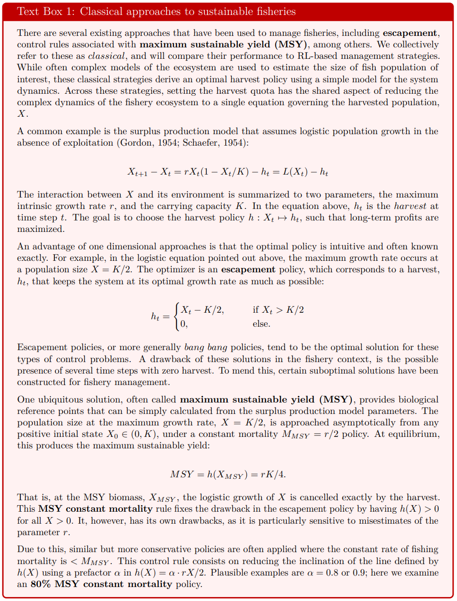

```{r knit_global, include=FALSE}
knitr::opts_chunk$set(cache = TRUE, echo = FALSE, message = FALSE, 
                      warning = FALSE, fig.height=5, fig.width=7.5)
library(tidyverse)
library(patchwork)
library(ggplot2)
```

```{r}
# read data
#frac_msy_8 <- read_csv("manuscript_data/0.8msy.csv.xz")
#frac_msy_9 <- read_csv("manuscript_data/0.9msy.csv.xz")
#frac_msy_95 <- read_csv("manuscript_data/0.95msy.csv.xz")
#frac_msy_100 <- read_csv("manuscript_data/1msy.csv.xz")
frac_msy <- read_csv("manuscript_data/frac_msy_summaries.csv.xz")

main_summaries <- read_csv("manuscript_data/comparison_3-2-var_300.csv.xz") %>%
  mutate(strategy=recode(strategy, "PPO+GP"="PPO_GP")) %>%
  arrange(strategy)

esc_ends <- read_csv("manuscript_data/esc_ends_100.csv.xz")
msy_ends <- read_csv("manuscript_data/msy_ends_100.csv.xz")
ppo_ends <- read_csv("manuscript_data/ppo300_ends.csv.xz")
gpp_ends <- read_csv("manuscript_data/gpp300_ends.csv.xz")
```

<!--
 Special Issue Description:

This special issue highlights the development of novel data-driven methods, including statistics, machine learning, parameter estimation, and uncertainty quantification, and combinations thereof, towards modeling biological systems. These newly developed methods will tackle challenges that are commonly encountered when modeling real-world experimental, field, pre-clinical, or clinical data. Examples of such challenges include high dimensionality, computational complexity, observation or process error, model bias, and intra- or inter-individual heterogeneity. Contributions to this special issue require validation of new methods with real-world data or simulated data sets that contain features of real-world data that exemplify an outlined modeling challenge. Papers should include a discussion justifying why the developed method is novel and not an application of previously developed methods, as well as how the method may be broadly applicable across different areas of biology, including medical, ecological, genetics, and epidemiological applications.
-->

# Introduction {#intro}

Much effort has been spent grappling with the complexity of our natural world in contrast to the relative simplicity of the models we use to understand it.
Heroic amounts of data and computation are being brought to bear on developing better, more realistic models of our environments and ecosystems, in hopes of improving our capacity to address the many planetary crises.
 But despite these efforts and advances, we remain faced with the difficult task of figuring out how best to respond to these crises.
While simplified models have historically allowed for exploration of large decision spaces, the new wave of rich models are applied to highly oversimplified descriptions of potential actions they seek to inform.
For instance, Global Circulation Models (GCMs) such as HadCM3 [@pope2000impact; @gordon2000simulation; @collins2001internal] model earth's climate using 1.5M variables, while the comparably vast potential action space is modeled as one of seven emissions marker scenarios from the IPCC [@riahi2017shared].

Even as our research community develops simulations of the natural world that fit only in supercomputers, we analyze a space of policies that would fit on index cards.
Similar combinations of rich process models and highly simplified decision models (often not even given the status of 'model') are common.
Modeling the potential action space as one of a handful of discrete scenarios is sometimes a well justified acknowledgement of the constraints faced by real-world decision-makers – particularly in the context of multilateral decisions –
and may seem to reflect a division of responsibilities between 'scientists' modeling the 'natural processes' and policy-makers who make the decisions.
But, more often, this simplification of decision choices is simply mathematically or conceptually convenient.  <!-- there are questions of policy scale hiding here -- e.g. local regulators of a specific industry obviously face a different action space than national legislatures or international diplomats -->
This simplification reflects trade-offs between tractablity and complexity at the basis of any mathematical modeling -- if we make both the state space and action space too realistic, the problem of finding the best sequence of actions quickly becomes intractable.
However, emerging data-driven methods from machine learning offer a new choice -- algorithms that can find good strategies in such problems, but at the cost of opacity.  

In this paper, we focus on a well-developed application of model-based management of the natural world that has long illustrated the trade-offs between model complexity and policy complexity: the management of marine fisheries.
Fisheries management is both an important issue to itself and a rich & frequent test-bed of ecological management more generally.
Fisheries are an essential natural resource that provide the primary source of protein for one in every four humans, and have faced widely documented declines due to over-fishing [@Worm2006, @Costello2016].
Fisheries management has  roots in both the fields of _ecosystem management_ and _natural resource economics_.
Both fields might trace their origins to the notion of maximum sustainable yield (MSY), introduced independently by a fisheries ecologist [@Schaefer1954] and the economist [@Gordon1954] in the same year.
From this shared origin, each field would depart from the simplifying assumptions of the Gordon-Schaefer model in divergent ways, leading to different techniques for deriving policies from models.The heart of the management problem is easily understood: a manager seeks to set quotas on fishing that will ensure the long-term profitability and sustainability of the industry.
Mathematical approaches developed over the past century may be roughly divided between these two fields: (A) ecologists, focused on ever more realistic models of the biological processes of growth and recruitment of fish while considering relatively stylized suite of potential management strategies, and (B) economists, focused on far more stylized models of the ecology while exploring a far less constrained set of possible policies.
The economist's approach can be characterized by the mathematics of a Markov decision process [MDP @Clark1973; @Clark1990; @Marescot2013], in which the decision-maker must observe the stock each year and recommend a possible action.
In this approach, the policy space that must be searched is exponentially large -- for a management horizon of T decisions and a space of N actions, the number of possible policies is $N^T$.
In contrast, fisheries ecologists and ecosystem management typically search a space of policies that does not scale with the time horizon.
Under methods such as "Management Strategy Evaluation" (MSE, [@Punt2016]) a manager identifies a candidate set of "strategies" a priori, and then compares the performance of each strategy over a suite of simulations to determine which strategy gives the best outcome (i.e. best expected utility).
This approach is far more amenable to complex simulations of fisheries dynamics and more closely corresponds to how most marine fishing quotas are managed today in the United States [see stock assessments documented in @RAMLegacyDB].
<!-- Do we say here that these strategies retain the 'constant mortality' intuition of @Schaefer? -->

```{r}
#| label: textbox
#| out.width: "1\\linewidth"

```

Recent advances in machine learning may allow us to once again bridge these approaches, while also bringing new challenges of their own.
Novel data-driven methods have allowed these models to evolve into ever more complex and realistic simulations used in fisheries management, where models with over 100 parameters are not uncommon [@RAMLegacyDB].
Constrained by computational limits, MDP approaches have been intractable on suitably realistic models and largely confined to more academic applications [@Costello2016].
However, advances _Deep Reinforcement Learning_, (DRL) a sub-field of machine learning, have recently demonstrated remarkable performance in a range of such MDP problems, from video games [@atari1; @atari2] to fusion reactions [@fusion1; @fusion2] to the remarkable dialog abilities of ChatGPT [@chatgpt].
RL methods also bring many challenges of their own: being notoriously difficult to train and evaluate, requiring immense computational costs, and presenting frequent challenges with transfer-ability or reproducibility.
A review of all these issues is beyond our scope but can be found elsewhere [@rl-intro; @millie-3].
Here, though, we will focus on the issue of opacity and interpretability raised by these methods.
In contrast with optimization algorithms currently used in either ecosystem management or resource economics, RL algorithms have no guarantees of or metrics for convergence to an optimal solution.
In general, one can only assess the performance of these black box methods relative to alternatives.

```{r}
#| label: conceptual
#| echo: FALSE
#| message: FALSE
#| fig.align: 'center'
#| fig.cap:  '(A) Classical management strategies are often derived by reducing the complex dynamics of the fishery ecosystem to a single equation governing the harvested population (say, $X$). where the interaction between $X$ and its environment is summarized to a set of parameters, such as the growth rate $r$, and the carrying capacity $K$. An advantage of one-dimensional approaches is that the optimal policy is often known exactly, and, moreover, is intuitive. For example, in the logistic equation shown, the maximal sustainable yield of the system is attained at K/2. 
#| (B) In contrast to this, we study the problem of managing a three species fishery, where we harvest species $X$.
#| In addition to $X$, there is a species $Y$ which competes with $X$ for resources, and a species $Z$ which preys on $X$ and $Y$.
#| We compare two approaches solving harvest strategies in this system. 
#| The first (Harvest $B_{\mathrm{i}}$) is based on the intuition obtained from 1D control: we use simulated data to empirically determine which constant mortality policy is optimal for controlling this fishery.
#| The second (Harvest $B_{\mathrm{ii}}$) is an RL policy, where the policy function is expressed as a neural network and the algorithm uses a variant of \emph{gradient ascent} (namely, \emph{Proximal Policy Optimizaton (PPO)}) to optimize this network.
#| Both approaches we compare are \emph{model-free:} the optimization algorithm treats the model as a black box, only using its input-output statistics.
#| This way, the optimal policy is not computed from the values of the model parameters, but rather by comparing how policies perform in controlling the system.'
#| out.width: '6.5in' 
#| fig.pos: 'H'
 
knitr::include_graphics("figures/conceptual.png")
```

<!--NEED some kind of map paragraph here saying what's ahead, what we show  -->
In this article, we compare the performance of a DRL solution to that of classical management strategies (see Textbox 1).\footnote{A repository with all the relevant code to reproduce our results may be found at \url{https://github.com/boettiger-lab/approx-model-or-approx-soln} in the ‘‘src’’ subdirectory. 
The data used is found in the ‘‘data’’ subdirectory, but the user may use the code provided to generate new data sets.} 
We consider the problem of devising harvest strategies in a for a series of ecosystem models (Figure **TBD**):
*1) one species, one fishery:* a simple single-species recruitment model based on [@may77];
*2) three species, one fishery:* a three-species generalization of model *1)*, where one of the species is harvested;
*3) three species, two fisheries:* the same three-species model as above but with two harvested species;\footnote{
As we prepared this manuscript we became aware of [@nicolalove] which considers an ecological control problem with a similar mathematical formulation, but using an analytical calculus-based approach.
}
*4) three species, two fisheries, parameter variation:* a three-species model of which two are harvested, as above, with a time-varying parameter.
This last model is meant to be a toy model of climate change's effect on the system.
Across all of these scenarios, two goals are balanced in the decision process: maximizing long-term catch and preventing stock sizes to fall below some a-priori threshold.

Regarding control for these 4 models, we show that: *1)* while all approaches match in performance in the single species deterministic model, even mild stochasticity plummets the performance of MSY relative to constant escapement. 
Moreover, DRL recovers the optimal constant escapement policy.
*2)* In the three species, single fishery model, all management strategies perform similarly.
*3)* In the three species, two fisheries model DRL outperforms both classical strategies, with MSY surprisingly performing significantly better than constant escapement.
In particular, we observe that DRL strategies are more sensitive to stochastic variations of the system which allows it to adaptively manage the system to prevent population collapses below the threshold.
*4)* In the three species, two fisheries model with parametric time-variation, the performance gap between DRL and MSY is broadened.
In this case, as in *3)*, constant escapement strategies perform significantly worse than DRL and MSY.

Our findings paint a picture of how a single-species optimal management strategy may loose performance rather dramatically when controlling a more complex ecosystem.
Moreover, rather unintuitively, management strategies, such as MSY, known to be suboptimal and unsustainable in the single-species can turn out to even outperform the aforementioned single-species optimal strategy (e.g. constant escapement).
Finally, within this regime of complex, possibly varying, ecosystems, we show that DRL consistently finds a policy which effectively either matches the best classical strategy, or outperforms it.
We strengthen this result with a stability investigation: we show that random perturbations in the model's parameter values used do not significantly vary the conclusion that DRL outperforms constant escapement.

We notice that both classical management strategies are faced with a tradeoff---optimal classical strategies accept a rather large fraction of episodes ending with a population crash, whose negative reward is counteracted with a higher economic output.\footnote{
In our mathematical formulation of the decision problem, we have assumed for simplicity that the fishing effort cost is zero and that fish price is stable over time.
This way, we equate economic output with harvested biomass.
}
Conversely, more conservative suboptimal classical strategies (e.g. with a higher constant escapement value) lead to lower total reward on average.
The DRL approach side-steps this tradeoff by optimizing over a more complex family of possible policies—policies parametrized by a neural network, as opposed to policies labeled by a single parameter (the mortality rate).
We thus observe that the DRL solution leads to a higher profitability *and* stability as compared to constant mortality policies. 

# Mathematical models of fisheries considered

Here we introduce the four mathematical models of fisheries for which we compare different management strategies.
In general, the class of models that appear in this context are *stochastic, first order, finite difference equations*.
For $n$ species, these models have the general form
\begin{align}
  \label{eq:general model}
  \begin{split}
    \Delta X_t &= f_X(N_t) + \eta_{X,t} - M_X X_t\\
    \Delta Y_t &= f_Y(N_t) + \eta_{Y,t} - M_Y Y_t\\
    \Delta Z_t &= f_Z(N_t) + \eta_{Z,t} - M_Z Z_t\\
    &\dots
  \end{split}
\end{align}
where $N_t = (X_t,\ Y_t,\ Z_t,\ \dots) \in \mathbb{R}^{n}_+$ is a vector of populations, $\Delta X_t := X_{t+1} - X_t$, $f_i:\mathbb{R}^{n}\to\mathbb{R}$ are arbitrary functions, and where $\eta_{i,t}$ are Gaussian random variables.
Here, $M_i=M_i(N_t)\in\mathbb{R}_+$ is a state-dependent fish mortality arising from harvesting the $i$-th species (sometimes this is referred to as *fishing effort*).

The term $M_X X_t$ is the total $X$ harvest at time $t$.
This formulation of stock recruitment as a discrete finite difference process is common among fisheries, as opposed to continuous time formulations which involve instantaneous growth rates.
This growth rate simplifies e.g. the possibly seasonal nature of reproduction (which would need to be accounted for in a realistic continuous-time model) by simply considering the total recruitment experienced by the population over a full year.

The fishing efforts are the *control variables* of our problem---these may be set by the manager at each time-step to specified values.
We make two further simplifying assumptions on the control problem:
*1. Full observation:* the manager is able to accurately measure $N_t$ and use that measurement to inform their decision.
*2. Perfect execution:* the action chosen by the manager is implemented perfectly (i.e., there is no noise affecting the actual value of the fishing efforts).
In future work, we intend to relax these assumptions to get more realistic management scenarios.

One of the models we consider is a single-species classical model of ecological tipping points.
The other three models are all three-species models with similar dynamics---differing by the amount of species that are harvested, and whether the parameters of the model are fixed or time-dependent.
Following this logic, the first subsection will be dedicated to the single-species model and the second will focus on the three-species models.

## The single species model

Optimal control policies for fisheries are frequently based on 1-dimensional models, $n=1$, as described in $Text$ $Box$ $1$.
The most familiar model of $f(X)$ is that of *logistic growth*, for which
\begin{align}
  \label{eq:logistic}
  f(X_t) = r X_t\big(1 - X_t / K \big) =: L(X_t;\ r, K).
\end{align}

Real world ecological systems are obviously far more complicated than this simple model suggests.
One particularly important aspect that has garnered much attention is the potential for the kind of highly non-linear functions that can support dynamics such as alternative stable states and hysteresis.
A seminal example of such dynamics was introduced in [@may77], using a one-dimensional model of a prey (resource) species under the pressure of a (fixed) predator:
\begin{align}
  \label{eq:may}
  \Delta X_t
  = L(X_t;\ r, K) - \frac{\beta H X_t^2}{c^2 + X_t^2} + \eta_{X,t} - M_X X_t.
\end{align}
In the following, we will denote
\begin{align*}
  F(X_t,H;\ \beta,c) := \frac{\beta H X_t^2}{c^2 + X_t^2}.
\end{align*}

The model has six parameters: the growth rate $r$ and carrying capacity $K$ for $X$, a constant population $H$ of a species which preys on $X$, the maximal predation rate $\beta$, the predation rate half-maximum biomass $c$, and the variance $\sigma_X^2$ of $\eta_{X,t}$. 
(Here and in the following we will center our random variables at zero.)

Eq. \eqref{eq:may} is an interesting study case of a *tipping point* (saddle-node bifurcation) (see Fig. \ref{fig:may}).
Holding the value of $\beta$ fixed, for intermediate values of $H$ there exist two stable fixed points for the state $X_t$ of the system, these two attractors separated by an unstable fixed point.
At a certain threshold value of $H$, however, the top stable fixed point collides with the unstable fixed point and both are annihilated.
For this value of $H$, and for higher values, only the lower fixed point remains.
This also creates the phenomenon of *hysteresis*, where returning $H$ to its original value is not sufficient to restore $X_t$ to the original stable state. 

```{r}
#| label: may
#| fig.cap: "The fixed point diagram for model (TBD) as a function of varying the parameter $\\beta H$, assuming zero noise.
#| Stable fixed points (also known as attractors) are plotted using a solid line, while the unstable fixed point is shown as a dotted line."
#| out.width: "6.5in"

knitr::include_graphics("figures/MayStablePoints.pdf")
```

This structure implies two things.
First, that a drift in $H$ could lead to catastrophic consequences, with the population $X_t$ plummeting to the lower fixed stable point.
Second, that if the evolution of $X_t$ is *stochastic*, then, even at values of $H$ below the threshold point, the system runs a sizeable danger of tipping over towards the lower stable point.


<!-- Discuss control solutions of this model(?) -->
<!-- Briefly motivate reason to consider 3d model, adding competition and predation processes -->


## The three species models

We consider three models of a three-species fishery ecosystem.
These are all closely related---in fact, their natural dynamics (i.e. dynamics under zero harvest) is given by the same equations:
\begin{align}
\label{eq:3d model}
\begin{split}
  \Delta X_t &= L(X_t;\ r_X, K_X) - F(X_t, Z_t;\ \beta, c) - c_{XY}X_tY_t + \eta_{X,t},\\
  \Delta Y_t &= L(Y_t;\ r_Y, K_Y) - D F(Y_t, Z_t;\ \beta, c) - c_{XY}X_tY_t + \eta_{Y,t},\\
  \Delta Z_t &= \left(f(X_t + DY_t\right) - d_Z)Z_t + \eta_{Z,t}.
\end{split}
\end{align}
The three species modelled are $X$, $Y$ and $Z$.
Species $Z$ preys on both $X$ and $Y$, while the latter two compete for resources.
There are thirteen parameters in this model: 
The growth rate and carrying capacity, $r_X$, $K_X$, $r_Y$ and $K_Y$, of $X$ and $Y$.
A parameter $c_{XY}$ mediating a Lotka-Volterra competition between $X$ and $Y$.
A maximum predation rate $\beta$ and a predation rate half-maximum biomass $c$ specifying how $Z$ forages on $X$ and $Y$.
A parameter $D$ regulating a relative preference of $Z$ to prey on $Y$.
A death rate $d_Z$ and a parameter $f$ scaling the birth rate of $Z$.
Finally, the noise variances $\sigma_X$, $\sigma_Y$ and $\sigma_Z$.

Eqs. \eqref{eq:3d model} are a generalization of the single-species model \eqref{eq:may}: this can be seen by setting 
\begin{align*}
  c_{XY} = d = f = \sigma_Z = 0.
\end{align*}
In our simulations, we use $c_{XY} = d = f = 0.1$ and $\sigma_Z=0.05$ so, in broad strokes, our three-species model is a slight perturbation of the single-species model.
Put differently, we are in a regime where, just by examining parameters, it would seem that the single-species model is a reasonable approximation.
**Is this clear? Should I maybe erase these last sentences?**

The three models will branch off of eq. \eqref{eq:3d model} in the following way.
*1. Three species, one fishery:* in this first model, only $X$ is harvested, that is, in the notation of eq. \eqref{eq:general model}, we fix $M_Y=M_Z=0$ and leave $M_X$ as a control variable.
All parameters here are constant.
*2. Three species, two fisheries:* as the previous case but with $X$ and $Y$ being harvested. 
In other words, we set $M_Z=0$ and leave $M_X$ and $M_Y$ as control variables.
Finally, *3. Three species, two fiseries, time-variation:* in this model we allow for the harvest of $X$ and $Y$, as in the previous model, but now we include a time dependent parameter:
\begin{equation}
  \label{eq:rx(t)}
  r_X = r_X(t) = 
  \begin{cases}
    1-t/200, \quad & t \leq 100,\\
    1/2, \quad & t > 100.
  \end{cases}
\end{equation}
This is intended to reflect in a simple manner a possible effect of climate change: where the reproductive rate of $X$ is reduced linearly over time until it stabilizes.
In future work we intend to capture more realistic models of the effects of climate change, but for this exploratory work we have chosen this simple expression for the sake of conceptual clarity.

# Reinforcement learning {#sec:RL}

Reinforcement learning (RL) is a way of approaching *sequential decision problems* through machine learning.
All applications of RL can be conceptually separated into two parts: an *agent* and an *environment* which the agent interacts with.
That is, the agent takes actions within the environment.
As a result of an agent's action, the environment will transition to a new state and return a numerical *reward* to the agent. (See Fig. 1 in [@rl-intro] for a conceptual description of reinforcement learning algorithms.)
The rewards encode the agent's goal.
The main task of any RL algorithm is then to maximize the cumulative reward received. 
This objective is achieved by aggregating experience in what is called the *training* period and learning from such experience.
<!-- ML: We could cite our deep RL paper here instead of going into further details. Not sure what we are expecting as the audience. -->.

<!-- The *environment* is commonly a computer simulation, although it sometimes can be a real world system.
The *agent*, on the other hand, is a computer program which interacts with the environment. -->

For our use case, the environment will be a computational model of the population dynamics of a fishery, with the environment state at time $t$ being a vector of all the fish populations, e.g. $N_t=(X_t,Y_t,Z_t)$ in the three species case.
At each time step, the agent observes the state $S$ and enacts some harvest---reducing $X_t$ to $X_t - M_X(N_t)\cdot X_t$, and, in the two-fishery scenario, also reducing $Y_t$ to $Y_t - M_Y(N_t)\cdot Y_t$.
Here the fish mortality-rates-from-harvest (i.e. $M_X=M_X(N_t)$ and $M_Y=M_Y(N_t)$), are the agent's action at time $t$. 
This secures a reward of $M_X(N_t)X$ in the single fishery case, and in the two-fishery case the reward is $M_X(N_t)X + M_Y(N_t)Y$.
After this harvest portion of the time step, the environment changes according to its natural dynamics given by \eqref{eq:3d model}.

As mentioned, this discretized time framework allows a simplification of the possibly seasonal mating behavioral patterns of the species involved. 
This approximation is commonly used in fisheries for species with annual reproductive cycles (see e.g. [@mangel2006theoretical], Chap. 6).
The division of the time-step into two parts (harvest and dynamics) happening sequentially is performed for all control methods evaluated, not only RL-based approaches.

## Mathematical framework for RL

The RL environment can be formally described as a discrete time *partially observable Markov decision process (POMDP)*.
This formalization is rather flexible and allows one, e.g., to account for situations where the agent may not fully observe the environment state, or where the only observations available to the agent are certain functions of the underlying state.
For the sake of clarity, we will only present here the class of POMDPs which are relevant to our work: *fully observable MDPs with a trivial emission function* (henceforth MDPs for short).
An MDP may be defined by the following data:

- $\mathcal{S}$: *state space*, the set of states of the environment,

- $\mathcal{A}$: *action space*, the set of actions which the agent may choose from,

- $T(N_{t+1}|N_t, a_t)$: *transition operator*, a conditional distribution which describes the dynamics of the system (where $N_i\in\mathcal{S}$ are states of the environment),

- $r(N_t, a_t)$: *reward function*, the reward obtained after performing action $a_t\in\mathcal{A}$ in state $N_t$,

- $d(N_0)$: *initial state distribution*, the initial state of the environment is sampled from this distribution,

- $\gamma\in[0,1]$: *discount factor*.

At a time $t$, the MDP agent observes the full state $s_t$ of the environment and chooses an action based on this observation according to a *policy function* $\pi(a_t | N_t)$.
In return, it receives a discounted reward $\gamma^t r(a_t, N_t)$.
The discount factor helps regularize the agent, helping the optimization algorithm find solutions which pay off within a timescale of $t \sim \log(\gamma^{-1})^{-1}$.

With any fixed policy function, the agent will traverse a path 
$\tau=(N_0,\ a_0,\ N_1,\ a_1\ \dots,\ N_{t_{\text{fin.}}})$ 
sampled randomly from the distribution
\begin{align*}
  p_\pi(\tau) = 
  d(N_0) \prod_{t=0}^{ t_{\text{fin.}}-1 }
  \pi( a_t | N_t ) T( N_{t+1} | N_t, a_t ).
\end{align*}
Reinforcement learning seeks to optimize $\pi$ such that the expected rewards are maximal,
$$  
  \pi^* = \mathrm{argmax}\ \mathbb{E}_{\tau\sim p_\pi}[R(\tau)],
$$
where,
$$
  R(\tau) = \sum_{t=0}^{ t_{\text{fin.}}-1 } \gamma^t r(a_t, N_t),
$$
is the cumulative reward of path $\tau$.
The function $J(\pi):=\mathbb{E}_{\tau\sim p_\pi}[R(\tau)]$ is called the *expected return*.

## Deep Reinforcement Learning

The policy function $\pi$ often lives in a high or even infinite-dimensional space.
This makes it unfeasible to directly optimize $\pi$.
In practice, an alternative approach is used: $\pi$ is optimized over a much lower-dimensional parameterized family of functions.\footnote{
Policies are, in general, functions from state space to policy space.
In our paper, these are $\pi:[0,1]^{\times 3}\to \mathbb{R}_+$ for the single fishery case, and $\pi:[0,1]^{\times 3}\to \mathbb{R}_+^2$ for two fisheries.
The space of all such functions is highly singular, spanning a \emph{non-separable Hilbert space}.
Even restricting ourselves to continuous policy functions, we end up with a set of policies which span the infinite dimensional space $L^2([0,1]^{\times3})$.
One way to avoid optimizing over an infinite dimensional ambient space is to discretize state space into a set of bins.
This approach runs into tractability problems: First, the dimension of policy space scales exponentially with the number of species.
Second, even for a fixed number of species (e.g., 3), the dimension optimized over can be prohibitively large---for example if one uses 1000 bins for each population in a three-species model, the overall number of parameters being optimized over is $10^9$.
Neural networks with much smaller number of parameters, on the other hand, can be quite expressive and sufficient to find a rather good (if not optimal) policy function.
}
<!-- ML: I am not following this line of thought here. I see the main reason why NN's are used as being that NN's are universal function approximators, and we don't know what the policy and/or value function will look like.

FM: my take here is that the space of functions from states to actions is in principle infinite-dimensional or at least very high dimensional. (e.g. exponentially high dimensional in terms of the number of degrees of freedom in state space, for the case of discretized state spaces).
By restricting our ansatz to neural networks of a fixed depth/breadth, we're restricting ourselves to a finite dimensional (or, in the discrete case, potentially much lower dimensional) manifold of policies over which gradient descent may be performed much more efficiently.
E.g. the dimensionality of the space we're searching for is determined by the size of the neural network, it's finite dimensional for continuous state spaces, and its dimension is not necessarily exponential in the number of species.
-->
Deep reinforcement learning uses this strategy, focusing on function families parameterized by neural networks. (See Fig. 1 and App. A in [@rl-intro] for a conceptual introduction to the use of reinforcement learning in the context of conservation decision making.)
<!--(See Fig. \ref{tbd}.)-->
<!-- The figure should kinda explain how the parametrization arises, and how gradient ascent is used. Maybe namedrop backpropagataion for the sake of usefulness to the reader? -->


We will focus on deep reinforcement learning throughout this paper.
Within the DRL literature there is a wealth of algorithms from which to choose from to optimize $\pi$, each with its pros and cons.
Most, if not all, of these are based on gradient ascent by using the technique of *back-propagation* to efficiently compute the gradient.
Here we have used only one such algorithm (*proximal policy optimization (PPO)*) for the sake of particularity---to draw a clear comparison between the RL-based and the classical fishery management approaches.
In practice, further improvements can be expected by a careful selection of the optimization algorithm. 
(See, e.g., [@franccois2018introduction] for an overview of different optimization schemes used in DRL.)

## Model-free reinforcement learning

Within control theory, the classical setup is one where we use as much information from the model as possible in order to derive an optimal solution.
Here, one may find a vast literature on model-based methods to attain optimal, or near-optimal, control (see, e.g., [@zhang2019near; @sethi2019optimal; @anderson2007optimal]).

The classical sustainable fishery management approaches summarized in Text Box 1, for instance, are model-based controls.
As we saw there, these controls may run into trouble in the case where there are inaccuracies in the model parameter estimates.

There are many situations, however, in which the exact model of the system is not known or not tractable.
This is a standard situation in ecology: mathematical models capture the most prominent aspects of the ecosystem's dynamics, while ignoring or summarizing most of its complexity.
In this case, it is clear, model-based controls run a grave danger of mismanaging the system.

Reinforcement learning, on the other hand, can provide a model-free approach to control theory.
While a model is often used to generate training data, this model is not directly used by model-free RL algorithms.
This provides more flexibility to use RL in instances where the model of the system is not accurately known.
In fact, it has been shown that model-free RL outperforms model-based alternatives in such instances [@mbpo].
(For recent surveys of model-based reinforcement learning, which we do not focus on here, see [@moerland2023model; @polydoros2017survey].)

This context provides a motivation for this paper. 
Indeed, models for ecosystem dynamics are only ever approximate and incomplete descriptions of reality. 
This way, it is plausible that model-free RL controls outperform currently used model-based controls in ecological management problems.

Model-free DRL provides, moreover, a framework within which agents can be trained to be generally competent over a *variety* of different models.
This could more faithfully capture the ubiquitous uncertainty around ecosystem models.
The aforementioned framework---known as *curriculum learning*---is considerably more intensive on computational resources than the ‘‘vanilla’’ DRL methods we have used in this paper.\footnote{
All our agents were trained in a local server with two commercial GPUs. 
The training time was between 30 minutes and one hour in each case.
}
Due to the increased computational requirements of this framework, we have left the exploration in this direction for future work.


# Methods

\textbf{The Environment.}
As seen in Fig. **TBD CONCEPTUAL**, we consider four different models of the ecosystem with which the fishery interacts, each of this is called an *environment*, alluding to the environment in an RL setting.
To recap, these four environments are a single-species growth model \eqref{eq:may} for a harvested species; a three-species model \eqref{eq:3d model stoch} with a single harvested species; the same three-species model but with *two* harvested species; and, finally, a three-species model with a time-varying parameter and two harvested species.

The policies explored were functions from states $N_t$ to either a single number $M_X(N_t) = \pi(N_t)$, or a pair of numbers $(M_X(N_t), M_Y(N_t)) = \pi(N_t)$ depending on the environment considered.
\textbf{Probably a table showing the different combinations of species and fishery numbers would be good, possibly giving these ‘scenarios’ names.}

Our goal is to evaluate the performance of different policy strategies over a specified window of time.
We have chosen this window to be 200 time-steps, where each discrete time-step represents the dynamical evolution of the system over a year.
_Episodes_ begin at time-step zero and are controlled by the policy and the system's natural evolution until either the maximum time-span is reached, or until a ‘‘near-extinction event’’ occurs---that is, until any of the populations go below a given threshold,
\begin{align}
  \label{eq:thresh}
  X_t \leq X_{\text{thresh.}},\quad
  Y_t \leq Y_{\text{thresh.}},\quad
  \text{or,}\quad
  Z \leq Z_{\text{thresh.}}.
\end{align}
In our setting we have chosen $X_{\text{thresh.}}=Y_{\text{thresh.}}=Z_{\text{thresh.}}=0.05$ as a rule of thumb---given that under natural (unharvested) dynamics the populations range within values of 0.5 to 1, this would represent on the order of a 90-95% population decrease from its ‘‘natural’’ level.

The reward function defining our policy optimization problem has two components.
The first is economical: the total biomass harvested over an episode.
The second seeks to reflect conservation goals: if a near-extinction event occurs at time $t$, the episode is ended early and a negative reward of $-100/t$ was awarded.
This reward function balances the extractive motivation of the fishery with conservation goals that go beyond the scope of long-term sustainable harvests.


\textbf{Training a DRL agent.}
We trained a DRL agent parametrized by a neural network with two hidden, 64-neuron, layers, on a local server with 2 commercial GPUs.
We used the Ray framework\footnote{\url{https://docs.ray.io/}} for training, specifically we used the Ray PPOConfig class to build the policy optimization algorithm using the default values for all hyper-parameters.
In particular, no hyperparameter tuning was performed.
The agent was trained for 300 iterations of the PPO optimization step for the three-species cases.
The total training time was on the order of 30 minutes to 1 hour.
For the single-species model, the training iterations were scaled down to 100 and the training time was around 10 minutes.

The state space used was normalized case-by-case as follows: 
*1)* for the single species model, a line segment $[0,1]$, *2)* for all three-species models, a cute $[0,1]^{\times 3}$.
We used simulation data to derive a bound on the population sizes typically observed, and thus be able to normalize states to a finite volume.

Policies obtained from the PPO algorithm can be ‘‘noisy’’ as their optimization algorithm is randomized (see, e.g. App. \textbf{TBD} for visualizations of these policies).
We perform some interpolation using a Gaussian process regressor in order to de-noise these policies.
Specifically, we use the *GaussianProcessRegressor* object of the *sklearn* Python library with a kernel given by
\begin{align*}
  \text{RBF}(\text{length scale = 10}) + \text{WhiteNosie}(\text{noise level = 0.1}).
\end{align*}
This interpolation method is applied to scatter data of the PPO policy evaluated on 3 different grids:
One $51\times 51 \times 5$, one $51\times 5 \times 51$ and one $5\times 51 \times 51$ grid on $(X,Y,Z)$ states.\footnote{
The raw dataset is found at \textbf{TBD} in the repository with the source code and data linked above.
Scatter plots visualizing this policy are shown in App. \textbf{TBD}.
}
The length scale and noise level values of this kernel were chosen arbitrarily---no hyperparameter tuning was needed to produce satisfactory interpolation, as will be shown in the results section.


\textbf{Tuning the constant mortality strategy.}
A grid of 101 mortality rates was laid in the interval $[0, 0.5]$ as possible mortality values in the single-fishery cases.
Due to the high memory usage in the two-fishery case, a slightly coarser $51\times51$ grid was set in the square $[0,0.5]^2$ instead.
Since the approach for tuning is completely analogous for all scenarios considered, here we focus on the ‘‘3 species, 1 fishery’’ case.
For each one of these choices of a constant mortality rate, say $M_X$, we simulated 100 episodes based on \eqref{eq:3d model stoch}:
At each time step the state $(X_t, Y_t, Z_t)$ was observed, a harvest of $M_X X_t$ was collected and then the system evolved according to its natural dynamics \eqref{eq:3d model stoch}.
The optimal mortality rate was the value $M_X^*$ for which the mean episode reward was maximal.
The result of the tuning procedure is shown in Fig. \ref{fig:tuning}. 


\textbf{Tuning the constant escapement strategy.}
This tuning procedure was analogous to that of the constant mortality strategy just summarized.
Namely:
A grid of 101 constant escapement values was laid out on the interval $[0,1]$ for the single-fishery models (resp. a $51\times 51$ grid on $[0,1]^2$ for two-fishery models).
These grids were the possible constant escapement values optimized over (in the two fishery case, these were $(\text{esc}_X,\ \text{esc}_Y)$ pairs).
That is, each grid point represents a constant escapement policy.
We used each of these policies to manage 100 replicate episodes.
The optimal policy was the policy with the highest average reward obtained.

\textbf{Parameter values used.}
The single-species model's (eq. \eqref{eq:may}) dynamic parameters were chosen as
\begin{align}
\label{eq:1d param vals}
r = K = 1,\quad \beta = 0.25,\quad c = 0.1.
\end{align}
Here, the values of $\beta$ and $c$ are chosen as to make the system be roughly close to its tipping point.

The three-species model's (eq. \eqref{eq:3d model stoch}) dynamic parameters were chosen as follows
\begin{align}
\label{eq:param vals}
\begin{split}
  r_X = K_X = r_Y = K_Y = 1, \quad \beta = 0.3, \quad c = 0.3\\
  c_{XY} = 0.1,\quad f = 0.1,\quad D = 1.1, \quad d_Z = 0.1.
\end{split}
\end{align}
Moreover, the variances for the stochastic terms were chosen as
$$
  \sigma^2(\eta_{X,t}) = \sigma^2(\eta_{Y,t}) = \sigma^2(\eta_{Z,t}) = 0.05.
$$
In the case with a time-varying $r_X$ parameter, we used $r_X(t)$ given as in eq. \eqref{eq:rx(t)} and all other parameters as given in eq. \eqref{eq:param vals}.

The values of $c$ and $\beta$ in the three-species model are slightly different than their values in the one-species model.
These values were chosen heuristically: 
We observed that choosing the lower value of $c=0.1$ in this case would lead to quick near-extinction events even without a harvest.
Moreover, $\beta$ was slightly increased simply to put more predation pressure on the $X$ and $Y$ populations and make them slightly more fragile.

\textbf{Stability analysis.}
To ensure that our results do not strongly depend on our parameter choices, we performed a stability analysis.
Here, we perturbed parameters randomly and measured the difference in performance between our DRL-based methods and the constant escapement strategy.
We observed that the difference in performance is maintained for even relatively high noise strengths.
For simplicity we only perform stability analysis on the ‘‘3 species, 2 fisheries and a time varying parameter’’ case. 

More specifically, for each parametric noise strength $\sigma_{\text{param.}}$ choice in $[0.04, 0.08, \dots, 0.2]$, we executed the following procedure:
Sample 100 choices of perturbed parameter values, where the perturbation is as follows---each parameter $P$ is perturbed to $(1+g_P)P$ where $g_P$ is a Gaussian random variable with variance $\sigma_{\text{param.}}^2$.
For each of these parameter choices, tune the constant escapement strategy and train the DRL model on the corresponding model.
Measure the average reward difference between strategies for each of these parameter choice samples using 100 replicate evaluation episodes.
Take the mean of this average difference over the 100 perturbed parameter samples.
The stability results are displayed in Fig. \textbf{TBD}.


# Results

We evaluated each of the four control approaches considered -- MSY constant mortality, optimal constant escapement, PPO, and Gaussian process interpolation of the latter -- on each of the four scenarios examined (see Sec. TBD).
Furthermore, we characterized the trade-off between economic output and sustainability faced by constant mortality policies.
This was done by evaluating constant mortality policies with a fraction of the optimal mortality rate (specifically, 80%, 90% and 95%).
All evaluations were based on 100 replicate episodes. 

We will visualize the results concerning the last scenario considered (‘‘3 species, 2 of which harvested, and a time-varying parameter’’) in this section, leaving the other cases for the appendix.
This is the most complex scenario considered and where our results show the most compelling advantage of DRL methods with respect to classical strategies.

Our main result is summarized in Fig. **TBD** which displays the total reward distributions for the policy obtained through each strategy.
Here we note two surprising things:
First, optimal constant escapement performs considerably worse than not only DRL-based methods, but also than MSY.
This conceptually shows how one-dimensional intuitions on ecological control may loose validity for complex ecosystems. **(this might be unwelcome by the reviewers if not discussed properly)**
Second, we see that classical strategies have relatively spread out reward distributions as compared to DRL methods.

```{r}
#| label: main
#| fig.cap: "Reward distributions for the four strategies considered. These are based on 100 evaluation episodes. We denote CEsc for constant escapement, CMort for constant mortality, PPO for the output policy of the PPO optimization algorithm, and PPO GP for the Gaussian process interpolation of the PPO policy."
#| out.width: "6in"
main_summaries %>% 
  ggplot() +
  geom_violin(mapping = aes(x=reward,y=strategy,fill = strategy)) +
  geom_boxplot(aes(x=reward,y=strategy, fill = strategy), width = 0.1, color = 'black', alpha=0.2)+
  theme(
    legend.position="none"
  )
```

To assess what is the culprit for the classical strategies' low performance with respect to the DRL-based strategies, we plot the duration of each of the 100 evaluation episodes of each strategy.
We see that early episode ends are a rather likely explanation for the wideness of constant escapement's wide reward distribution.
The constant mortality strategy is also observed to lead to near-extinction events rather often, but in this case the episode lengths tend to be concentrated at higher values relative to the constant escapement case.

We examine the trade-off between profit and sustainability faced by classical strategies in Fig. **TBD**.
Here, two quantities are plotted: the fraction of evaluation episodes of maximal length (i.e. episodes with no near-extinction events) is and the average reward obtained.
On the x-axis we have several sub-optimal constant mortality strategies that err on the conservative side: e.g. the policy labeled ‘‘80% MSY’’ has the form
\begin{align*}
  \pi: (X_t, Y_t, Z_t)\mapsto (0.8 M_X^*,\ 0.8 M_Y^*),
\end{align*}
where $(M_X^*,\ M_Y^*)$ is the optimal constat mortality strategy.
We see that sufficiently conservative policies attain high sustainability, but only at a high price in terms of profit.\footnote{
As noted before, here we equate economic profit with biomass caught.
This is done as an approximation to convey the conceptual message more clearly, and we do not expect our results to significantly change if, e.g., ‘‘effort cost’’ is included in the reward function.
When we refer to ‘‘large differences’’ in profit, or ‘‘paying dearly,’’ we mean that the ratio between average rewards is considerable---e.g. a 15\% loss in profit.
}

One problem that is often encountered when using machine learning methods is the interpretability of the output of these methods.
In our case, the output is a policy function parametrized by a neural network $\theta$:
\begin{align*}
  \pi_\theta: N_t \mapsto (M_X(N_t), M_Y(N_t)),
\end{align*}
where $N_t=(X_t,Y_t,Z_t)$ is the state of the system at time $t$, and where $M_X$ and $M_Y$ are the mortalities due to harvest during that time-step.
Here we visualize this policy function and provide an interpretation for it.
Given its high dimension, it is not possible to fully display how the policy function obtained ‘‘looks like’’---we thus project it down to certain relevant axes.
The result of this procedure is shown in Fig. **TBD**.
In that figure, the shape of the optimal escapement strategy is provided for comparison.

We notice that the DRL-derived policy has similarities to a constant escapement policy.
Here, the key difference is that the escapement value for each of the fished species is sensitive to variations in the other populations. 
This can be seen as a color gradients in the plots of $(X, M_X)$ and $(Y, M_Y)$, where the gradient corresponds to differing values of $Z$.
Moreover, this can be seen as an anti-correlation in the plot of $(X, M_Y)$---for optimal constant escapement, $M_Y$ is uncorrelated to $X$.

The sensitivity of the policy to, e.g., the values of $Z$ can be seen in the sample time series displayed in Fig. **TBD**.
Here, we can see that species $Z$ becomes endangered due to harvesting for all management strategies.
The DRL-based strategy, however, is sensitive to the values of $Z$ and can respond accordingly by scaling the fishing effort with the value of $Z$.
In particular, the policy responds to periods of low values of $Z$ by restricting fishing on $X$ and $Y$, thus promoting $Z$'s growth.
This pattern is rather common among the whole dataset---early episode ends are largely due to near-extinctions of $Z$ for all management strategies.

## Recovering constant escapement for a single species

While the optimal control for our single-species model \eqref{eq:may} can not be easily proven to be constant escapement (since the right-hand side of that equation is not concave), from experience we can expect for constant escapement to either be optimal or near-optimal.
We give evidence for this intuition by showing that our DRL method recovers a constant escapement solution when trained.
These results are shown in Fig. TBD.

## Stability analysis

In this section we present results intended to show that the effects that we observe in this paper are not the result of a careful selection of parameter values, but rather arise for a wide variety of parameter values.

Our main result in this respect is Fig. **TBD**.
There, we plot the *median episode reward difference* between the two DRL-based methods we considered, and the optimal constant escapement strategy.
This figure shows that, for a wide range of parameter values, DRL-based strategies can have a considerable advantage over an optimized constant escapement policy (the single-species optimal solution).

## Old results (to be copy-pasted above)

In Fig. \ref{fig:timeseries} we show the time series of one such repetition.
The left panel uses an MSY constant mortality control $M^*X$, the middle panel uses $0.8 M^* X$, while the right panel is controlled by the trained DRL agent.
We see that that optimal constant mortality control leads to a near-extinction event at around $t=150$.
The constant mortality policy at $0.8 M^*$ is already conservative enough to support a sustainable path.
There, the population levels are maintained roughly in a stationary state.
Finally, the DRL time series shows an oscillatory behavior, with a slight dephase between the $Y$ and $Z$ curves, while the $X$ oscillations are roughly anticorrelated with $Z$.

This time series is representative of the patterns observed in the data (see App. A.1).
The episode reward and episode length statistics are shown in Fig. \ref{fig:rew_len_fig}.
There, we highlight two things:
First, that the tendency towards early episode ends is fixed by the conservative approach of fishing at 80% of the MSY mortality rate.
(In App. A.2 we discuss and evaluate other policies using a fixed-percentage of the MSY mortality rate.)
Second, that while the conservative 80% approach has a stable behavior, it consistently produces smaller harvests than a DRL generated policy.

To understand the DRL-derived policy, Fig. \ref{fig:action-X} depicts the harvest as a function of $X$.
Specifically, for each point $(x,y,z)$ visited by one of the aforementioned 50 evaluation episodes, we evaluate the harvest collected by the DRL agent and we subsequently plot the scatter data as a function of the projection $x$ onto the $X$ axis.
In panel A we have used color to add the a $Y$-dependence, while in panel B we did the same with $Z$-dependence.
This shows that the $Z$ and $Y$ dependence of the policy is rather weak and in fact it has roughly the same shape as an escapement policy.

Fig. \ref{fig:action-X} additionally shows (pink line) the optimal constant escapement policy and the MSY constant mortality policy (green line).
The optimal constant escapement was computed in a manner similar to how the MSY constant mortality was computed: for each escapement in a grid of 100 values between 0 and 1, 50 episodes were run using the corresponding escapement policy.
The value with the best mean episode reward was chosen as the optimal escapement value.
We observe that the DRL policy approximates the optimal constant escapement policy, with the difference of being more conservative in its harvest at high $X$ values.
This pattern can be seen in panels (C-D), where at high $X$ values, the DRL escapement mildly increases in a non-linear fashion rather than staying constant.
Finally, relative to these two policies, we observe that MSY constant mortality underfishes at high $X$ values and overfishes at low $X$ values.


In Fig. \ref{fig:state-space}, we perform a back to back visualization of all the policies evaluated---MSY constant mortality, 80% MSY constant mortality, DRL and optimal constant escapement.
The policies are computed at each state along the paths they traverse in the 50 evaluation rounds, and the values are projected on the $X$-$Z$ plane for visualization.
This figure highlights the similarity between the policy found by the DRL agent and the optimal escapement policy.

Notice the anti-correlation between $X$ and $Y$ along the paths, this is especially prominent for the constant mortality plots.
This anti-correlation is, furthermore, observed in the time series plots (see Fig. \ref{fig:timeseries} and App. A.1).


# Discussion

Fisheries are complex ecosystems, with interactions between species leading to highly non-linear dynamics.
While current models for population estimation include many important aspects of this complexity, it is still common to use simplified dynamical models in order to guide decision making.
This provides very interpretable solutions, such as constant mortality policies.
There is a drawback here, however: due to the simplicity of these dynamical models, the policies might not respond effectively in many situations---situations where the predictions of these simple models deviate considerably from reality.
Because of this, policies such as MSY have faced pushback and are believed to have contributed to the depletion of fish stocks [@Worm2006; @Costello2016].

We propose an alternative approach to the problem of fishery control: to use a more expressive -- albeit more complicated -- dynamical model to guide decision making.
Furthermore, rather than computing the optimal control policy for the model (something that is impossible in practice for complex systems) we use deep reinforcement learning to obtain a ‘‘pretty darn good’’ policy.
This policy is estimated in a *model-free* setting, i.e., the agent treats the dynamical model (e.g. eq. \eqref{eq:3d model stoch}) as a black box of input-output pairs.
By not relying on precise knowledge of the model's parameter values, but rather just relying on input-output statistics, model-free approaches have gained traction in a variety of control theory settings (see, e.g., [@sato2019; @ramirez2022; @zeng2019]).

We compare deep reinforcement learning-based policies against optimal constant mortality policies. 
While the latter are MSY-inspired, they are optimized in a model-free way as well: the optimal constant mortality rate is computed empirically from simulated data.

Because of the simplicity of the constant mortality ansatz, the optimal such policy may be easily estimated (see Figure \ref{fig:tuning}).
In contrast, DRL optimizes over the more expressive -- and more complicated -- family of policies parametrized by a neural network.
Because of this, our DRL approach uses a variant of *gradient ascent* (the proximal policy optimization algorithm) to obtain a good candidate policy.

We have shown that the DRL agent finds an approximately *bang-bang* type of solution (see Text Box 1 for the definition of bang-bang solutions and Figs. \ref{fig:action-X} and \ref{fig:state-space} for the result).
While bang-bang solutions are known to be optimal for a wide variety of single-species fishery control problems [@hening2019; @hening2021], there is no such proof of optimality for general multi-species models.
In this sense this example is rather surprising and reassuring: while no general guarantee points at the optimality of bang-bang solutions for multi-species model, the existence of one such example provides a benchmark for the use of DRL in fishery control.

One intuition for why a constant escapement policy performs so well in such a model comes from the anti-correlation between $X$ and $Y$ noted in the results section.
We have observed this pattern arise in a variety of policies, both classical as well as some obtained by training DRL agents.
In fact, ‘‘crashes’’ in the $X$ population are almost invariably shortly preceeded by dramatic increases in $Y$.
We hypothesize that this effectively leads to a dimensionality reduction: once the value of $X$ is known, along a path traced by the control system, then $Y$ may be roughly predicted.
A similar, although weaker, anti-correlation is also observed between $X$ and $Z$.
These two informal observations point at an effective simplification of the prediction process: the values of $Y$ and $Z$ are much less impactful to policy decisions than the value of $X$ itself.
We have not yet pushed further to establish a more precise picture of this dynamical simplification.\footnote{
A hand-waving way to understand this phenomenon is the following:
The $X$-$Y$ anti-correlation can be associated to the Lotka-Volterra competition term between $X$ and $Y$, i.e. $c_{XY}XY$ in eq. \eqref{eq:3d model stoch}.
Now, consider a fall in population $X$.
Because of the aforementioned anti-correlation with $Y$, this is accompanied by a growth in $Y$.
We may understand this, roughly, as a \emph{replacement} of $X$ for $Y$.
But then, because the parameter $D = 1.1 > 1$, this increases the effective birth rate $Z$, i.e. the term $f(X+DY)Z$ in eq. \eqref{eq:3d model stoch}.
This, in turn, leads to a growth of $Z$ and, thus, an anti-correlation between $Z$ and $X$.}

This manuscript functions as a first step in the process of incorporating DRL into fishery decision making.
We have shown that highly non-linear systems may give rise to simple, good policies, and that these may be found via reinforcement learning.
Moreover, the framework allows for the possibility that these simplifications do not in fact happen, and that good harvest policies are highly non-linear, multi-parameter functions.

In this regard, DRL provides a framework flexible enough to capture the intricate population dynamics that are relevant in fishery management.
Importantly, DRL is equipped with tools to deal with complex models for which simple policies might yield unsatisfactory results (and thus more refined techniques are needed to control them).
For example, tools such as *long short-term memories* [@lstm], *curriculum learning* [@curriculum-learning] and *open-ended learning* [@open-ended] can be incorporated when faced with parametric noise or drift, or generally uncertainties about the agent's environment. 
These techniques can be used to obtain agents who perform well over a variety of different environments. <!-- ML: Could also use LSTMs for parametric drift. Might be better to use a different selling point for curriculum learning like if you want to have a bit more generalizability in your RL agent. -->

Finally, in our study case, we have shown that the ‘‘rest periods’’ -- periods of several time steps with no fishing at all -- prominent in both the DRL solution and in the optimal bang-bang policy, may be important to maintain the sustainability of the fishery and to increase its long-term profits.
This hypothesis could be explored in more generality as it might apply to a wide variety of models.

## Acknowledgements

The title of this piece references a mathematical biology workshop at NIMBioS
organized by Paul Armsworth, Alan Hastings, Megan Donahue, and Carl Towes in
2011 which first sought to emphasize 'pretty darn good' control solutions to
more realistic problems over optimal control to idealized ones. 
This material is based upon work supported by the National Science Foundation under Grant No. DBI-1942280.

\appendix

# Appendix

## Collected time series data

In this appendix we provide a wider selection of time series taken from the same data set as Fig. \ref{fig:timeseries}.
Namely, Figs. \ref{fig:timeseries_msy}, \ref{fig:timeseries_tac} and \ref{fig:timeseries_ppo} display these time series.


## Conservative scale-downs of MSY

Here we show the performance of constant mortality policies with a fraction $\alpha$ of the MSY mortality rate (in the main text we focused on $\alpha=0.8$).
Their performance is evaluated in Fig. \ref{fig:several-tac}.
Notice the sharp transition in performance between $\alpha = 0.9$ and $0.95$.
While the behaviour of the former closely mimics, e.g., the $\alpha=0.8$ policy, the performance of the latter is essentially the same as the optimal constant mortality ($\alpha=1$, see Fig. \ref{fig:rew_len_fig}).
This points at the fact that the value of the parameter $\alpha$, although commonly chosen simply as a rule of thumb, lives on a ‘‘knife's edge,’’ small changes in this parameter may lead to drastic changes in the dynamics of the controlled system.
What is worse: the particular scale at which this transition happens is generally dependent on the system's intrinsic dynamics.
In reality, where fishery models and their respective parameters are subject to substantial uncertainty, this fact calls to question the purported additional safety obtained via these rules of thumb.


## Optimal constant escapement policy evaluation

Here we reproduce the plots from the main text for the optimal constant escapement policy to illustrate the similarity to the DRL-derived policy.

Fig. \ref{fig:esc-tuning-eval} illustrates the tuning process of finding the optimal constant escapment policy (left panel, compare Fig. \ref{fig:tuning}).
The same figure shows, in the middle panel, the reward histogram for the optimal constant escapement policy (compare Fig. \ref{fig:rew_len_fig}).
Finally, the right panel displays the same histogram for the DRL policy (reproduced from Fig. \ref{fig:rew_len_fig}).
We may see that the two policies lead to essentially the same reward distribution.


Fig. \ref{fig:timeseries_esc} displays 9 time-series for episodes controlled with the optimal constant escapement policy.
Again, this behaviour is essentially indistinguishable from the behavior of the system controlled by the DRL policy (see Fig. \ref{fig:timeseries_ppo}).

This series of figures gives evidence that, in fact, the DRL agent we have trained has obtained a policy which, effectively, acts as an optimal constant escapement policy.
Although in Fig. \ref{fig:action-X} we found some deviations from the constant escapement case (e.g. DRL was more conservative when fishing high populations), these do not seem to lead to a different dynamics.


# References


