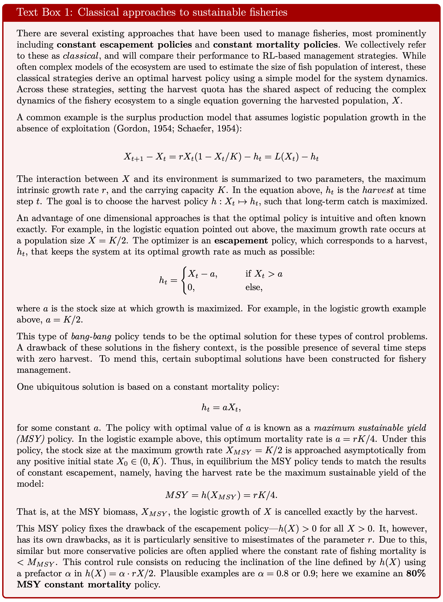

```{r knit_global, include=FALSE}
knitr::opts_chunk$set(cache = TRUE, echo = FALSE, message = FALSE, 
                      warning = FALSE, fig.height=5, fig.width=7.5)
library(tidyverse)
library(patchwork)
```

```{r}
# for best const mortality and best const escapement
msy_optimizer <- function(df) {
  df |> 
  group_by(action, rep) |>
  filter(t == max(t)) |> 
  group_by(action) |>
  summarise(mean_reward = mean(reward), sd = sd(reward)) |> 
  filter(mean_reward == max(mean_reward))
}
escapement_optimizer <- function(df) {
  df |> 
  group_by(escapement, rep) |>
  filter(t == max(t)) |> 
  group_by(escapement) |>
  summarise(mean_reward = mean(reward), sd = sd(reward)) |> 
  filter(mean_reward == max(mean_reward))
}

# Collect data (outsource to separate R script later TBD)
msy_df <- read_csv("../data/msy.csv.xz")
best_action <- msy_optimizer(msy_df)$action
escapement_df <- read_csv("../data/escapement.csv.xz", show_col_types = FALSE)
best_e <- escapement_optimizer(escapement_df)$escapement
ppo_df <- read_csv("../data/PPO200.csv.xz")

opt_escapement <- escapement_df |> filter(escapement == best_e)

# set up for plots:

msy_sim <- msy_df |>
    filter(action == best_action) |> 
    group_by(rep) |>
    pivot_longer(c("X", "Y", "Z"),
                names_to = "species", values_to = "abundance") |>
    mutate(abundance = abundance + 1, policy = "msy") # natural units, policy name

actions <- unique(msy_df$action)
i <- which.min(abs(actions - best_action* 0.8))
tac_sim <- msy_df |> 
    filter(action == actions[[i]]) |>
    pivot_longer(c("X", "Y", "Z"),
        names_to = "species", values_to = "abundance") |>
    mutate(abundance = abundance + 1, policy = "tac")

ppo_sim <- ppo_df |> 
    pivot_longer(c("X", "Y", "Z"),
        names_to = "species", values_to = "abundance") |>
    mutate(abundance = abundance + 1, policy = "ppo")

best_e <- 0.61 # optimal constant escapement, computed from ../data/escapement.csv.gz
esc_sim_df <- escapement_df |> 
    pivot_longer(c("X", "Y", "Z"),
        names_to = "species", values_to = "abundance") |>
    mutate(abundance = abundance + 1)

msy_tac_ppo <- bind_rows(msy_sim, tac_sim, ppo_sim)
```

<!--
 Special Issue Description:

This special issue highlights the development of novel data-driven methods, including statistics, machine learning, parameter estimation, and uncertainty quantification, and combinations thereof, towards modeling biological systems. These newly developed methods will tackle challenges that are commonly encountered when modeling real-world experimental, field, pre-clinical, or clinical data. Examples of such challenges include high dimensionality, computational complexity, observation or process error, model bias, and intra- or inter-individual heterogeneity. Contributions to this special issue require validation of new methods with real-world data or simulated data sets that contain features of real-world data that exemplify an outlined modeling challenge. Papers should include a discussion justifying why the developed method is novel and not an application of previously developed methods, as well as how the method may be broadly applicable across different areas of biology, including medical, ecological, genetics, and epidemiological applications.
-->

# Introduction {#intro}

Much effort has been spent grappling with the complexity of our natural world in contrast to relative simplicity of the models we use to understand it.
Now, as we grapple with the manifold consequences of human impacts on that world, we are faced with difficult questions of figuring out how best to respond when our knowledge and models fall so far short of the complexity our actions have disrupted.
Heroic amounts of data and computation are being brought to bear on developing better, more realistic models of our environments and ecosystems.
However, these rich models are applied to highly oversimplified descriptions of potential actions they seek to inform.
For instance, Global Circulation Models such as HadOM3 model earth's climate using 1.5M variables, while the comparably vast potential action space of is modeled as one of six emissions scenarios from the IPCC.
Even as our research community develops simulations of the natural world that fit only in supercomputers, we analyze a space of policies that would fit on index cards.
Similar combinations of rich process models and highly simplified decision models (often not even given the status of 'model') are common.
Modeling the potential action space as one of a handful of discrete scenarios is sometimes a well justified acknowledgement of the constraints of real-world decision-makers -- 
and may seem to reflect a natural division of responsibilities between 'scientists' modeling the 'natural processes' and policy-makers who must make the decisions.
But often this simplification of decision choices is simply mathematically or conceptually convenient.  <!-- there are questions of policy scale hiding here -- e.g. local regulators of a specific industry obviously face a different action space than national legislatures or international diplomats -->
This reflects trade-offs between tractablity and complexity at the basis of any mathematical modeling -- if we make both the state space and action space too realistic, the problem of finding the best sequence of actions quickly becomes intractable. 
However, emerging data-driven methods from machine learning offer a new choice -- algorithms that can find good strategies in such problems, but at the cost of opacity.  

In this paper, we focus on a well-developed application of model-based management of the natural world that has long illustrated the trade-offs between model complexity and policy complexity: the management of marine fisheries. 
Fisheries management is both an important issue to itself and a rich & frequent test-bed of ecological management more generally.
Fisheries are an essential natural resource that provide the primary source of protein for one in every four humans, and have faced widely documented declines due to over-fishing [@Worm2006, @Costello2016].
In the start of this literature we find the roots of both the fields of _ecosystem management_ and _natural resource economics_.
Both fields might trace their origins to notion of maximum sustainable yield (MSY), introduced independently by a fisheries ecologist @Schaefer1954 and the economist @Gordon1954 in the same year.
From this shared origin, each field would depart from the simplifying assumptions of the Gordon-Schaefer model in different ways, leading to different techniques for deriving policies from models.The heart of the management problem is easily understood: a manager seeks to set quotas on fishing that will ensure the long-term profitability and sustainability of the industry.
Mathematical approaches developed over the past century may be roughly divided between two camps: (A), ecologists, focused on ever more realistic models of the biological processes of growth and recruitment of fish while considering relatively stylized suite of potential management strategies, and (B) economists, focused on far more stylized models of the ecology while exploring a far less constrained set of possible policies. 
The economist's approach can characterized by the mathematics of a Markov decision process [MDP @Clark1974; @Clark1990; @Marescot2013], in which the decision-maker must observe the stock each year and recommend a possible action.
Note that the policy space that much be searched is exponentially large -- for a management horizon of T decisions and a space of N actions, the number of possible policies is N^T.
In contrast, fisheries ecologists and ecosystem management typically search a space of policies that does not scale with the time horizon.
Under methods such as "Management Strategy Evaluation" (MSE, [@Punt2016]) a manager identifies a candidate set of "strategies" a priori, and then compares the performance of each strategy over a suite of simulations to determine which strategy gives the best outcome (i.e. best expected utility).
This approach is far more amenable to complex simulations of fisheries dynamics and more closely corresponds to how most marine fishing quotas are managed today in the United States [see stock assessments documented in @RAMLegacyDB].
<!-- Do we say here that these strategies retain the 'constant mortality' intuition of @Schaefer? -->

Recent advances in machine learning may now once again bridge these approaches, while also bringing new challenges of their own. 
Novel data-driven methods have allowed these models to evolve into ever more complex and realistic simulations used in fisheries management, where models with over 100 parameters are not uncommon [@RamLegacyDB].
Constrained by computational limits, MDP approaches have been intractable on suitably realistic models and largely confined to more academic applications [@Costello2016].
However, advances _Deep Reinforcement Learning_, (RL) a sub-field of machine learning, have recently demonstrated remarkable performance in a range of such MDP problems, from video games [@atari] to fusion reactions [@fusion] to the remarkable dialog abilities of ChatGPT [@chatgpt].
RL methods also bring many challenges of their own: being notoriously difficult to train and evaluate, immense computational costs, and frequent challenges with transfer-ability or reproducibility. 
A review of all these issues is beyond our scope but can be found elsewhere [@rl_intro; @millie_AM-RL].
Here, though, we will focus on the issue of opacity and interpretability raised by these methods.
In contrast with optimization algorithms currently used in either ecosystem management or resource economics, RL algorithms have no guarantees of or metrics for convergence to an optimal solution.
We can only assess the performance of these black box methods relative to alternatives.


Specifically, most fisheries policies are framed in terms of a *constant mortality* policy, (sometimes a simple piece-wise linear function, i.e. a single linear segment, is introduced as a precaution a very low stock sizes), where fishing 'mortality' is defined as the ratio of harvest (catch) to stock size, $F = H_t/x_t$.

```{r}
#| label: textbox
#| out.width: "1\\linewidth"


```


```{r}
#| label: conceptual
#| echo: FALSE
#| message: FALSE
#| fig.align: 'center'
#| fig.cap:  '(A) Classical management strategies often have the common aspect of reducing the complex dynamics of the fishery ecosystem to a single equation governing the harvested population (say, $V1$). where the interaction between $V1$ and its environment is summarized to a set of parameters, such as the growth rate $r$, and the carrying capacity $K$. An advantage of one-dimensional approaches is that the optimal policy is often known exactly, and, moreover, is intuitive. For example, in the logistic equation shown, the maximal sustainable yield of the system is attained at K/2. 
#| (B) RL allows us to solve for quantitative decision strategies considering more complex ecosystem dynamics. For example, in this paper, we find harvest strategies for a three-species model using a model-free RL algorithm, PPO. 
#| (C) We show how the RL-based solution that considers all three species finds harvest policies with higher average reward and with (D) lower probability of harvest species collapse than the classical approaches, only considering the dynamics of V1.'
#| out.width: '6.5in' 
#| fig.pos: 'H'
 

```

<!--
Figure 1: 1-D and 3-D model conceptual figure. something about the objective / decision
Figure 2: Stability / multistability in the 1D and 3D models.  state space + time views
Figure 3: The 1-D optimal management solution.  'constant escapement' intuition etc

RL figures:
- schematic of RL (a-la previous marcus paper Fig 1)
- Neural network optimization figure

Results figures:
- timeseries example of management under the RL policy.  probably compare to managing under 1-D solution / rule-of-thumb methods
- state-space view of management doughnut 
- visualization / encapsulation of the policy heatmaps, slices, policy vs position along ellipse 
- reward plot over time (comparing methods)
-->

# Mathematical models of fisheries

In this section we introduce some models describing the population dynamics of fisheries.
In general, the class of models that appear in this context are *first order finite difference equations* (potentially stochastic difference equations).
For $n$ species, these models have the general form
\begin{align}
  \label{eq:general model}
  \begin{split}
    \Delta X_t &:= X_{t+1} - X_t = f_X(N_t) - M_X X_t\\
    \Delta Y_t &:= X_{t+1} - Y_t = f_Y(N_t) - M_Y Y_t\\
    &\dots
  \end{split}
\end{align}
where $N_t = (X_t,\ Y_t,\ \dots) \in \mathbb{R}^{n}_+$ is a vector of populations and $f_i:\mathbb{R}^{n}\to\mathbb{R}$ are arbitrary functions.
Here, $M_i=M_i(N_t)\in\mathbb{R}_+$ is a state-dependent fish mortality arising from harvesting (sometimes referred to as *fishing effort*).
Thus, the term $M_X X_t$ is the total $X$ harvest at time $t$.
We will focus on systems where a single species, $X$ is harvested, i.e. $M_Y = M_Z = \dots = 0$.

## A single species model

Optimal control policies for fisheries are frequently based on 1-dimensional models, $n=1$.
The most familiar model of $f(X)$ is that of *logistic growth*, for which

\begin{align}
  \label{eq:logistic}
  f(X_t) = r X_t\big(1 - X_t / K \big) =: L(X_t;\ r, K).
\end{align}

The model this $f$ gives rise to is known as the Gordon-Schaefer model, after foundational work which first developed the concept of maximum sustainable yield, MSY, [@Gordon1954; @Schaefer1954], which remains a central concept in fisheries management.
In this model, the maximum growth rate occurs at population size of $N = K/2$.
This value is approached asymptotically, from any positive initial state $N_0 \in (0,K)$, under a constant mortality $F = r/2$ policy.
At equilibrium this produces an asymptotic harvest of $rK/4$ per time step---the maximum yield sustainable indefinitely.


Real world ecological systems are obviously far more complicated than this simple model suggests.
One particularly important aspect that has garnered much attention is the potential for the kind of highly non-linear functions that can support dynamics such as alternative stable states and hysteresis.
A seminal example of such dynamics was introduced in \cite{may77}, using a one-dimensional model of a prey (resource) species under the pressure of a (fixed) predator:

\begin{align}
  \label{eq:may}
  f_{\text{May}}(X_t)
  := L(X_t;\ r, K) - F(X_t, H; \beta,c),
\end{align}
where,
\begin{align*}
  F(X_t,H;\ \beta,c) := \frac{\beta H X_t^2}{c^2 + X_t^2}.
\end{align*}

The model has five parameters: the growth rate $r$ and carrying capacity $K$ for $X$, a constant population $H$ of a species which preys on $X$, the maximal rate of predation $\beta$, and the predation half-maximum biomass $c$.

Eq. \eqref{eq:may} is an interesting study case of a *tipping point* (saddle-node bifurcation) (see Fig. \ref{fig:may stable}).
Holding the value of $\beta$ fixed, for intermediate values of $H$ there exist two stable fixed points for the state $\hat X_t$ of the system, these two attractors separated by an unstable fixed point.
At a certain threshold value of $H$, however, the top stable fixed point collides with the unstable fixed point and both are annihilated.
For this value of $H$, and for higher values, only the lower fixed point remains.
This also creates the phenomenon of *hysteresis*, where returning $H$ to its original value is not sufficient to restore $\hat X_t$ to the original stable state. 

\begin{figure}
  \centering
  \includegraphics[width = 0.8\linewidth]{figures/MayStablePoints.pdf}
  \caption{
    \label{fig:may stable}
    The fixed point diagram for the model \cite{may77} associated to $f_{\text{May}}$ as a function of varying the parameter $\beta H$.
    That is, these are the zeroes of the function $f_{\text{May}}$. 
    Stable fixed points (also known as *attractors*) are plotted using a solid line, while the unstable fixed point is shown as a dotted line.
  }
\end{figure}

This structure implies two things.
First, that a drift in $H$ could lead to catastrophic consequences, with the population $X_t$ plummeting to the lower fixed stable point.
Second, that if the evolution of $X_t$ is *stochastic*, then, even at values of $H$ below the threshold point, the system runs a sizeable danger of tipping over towards the lower stable point.


<!-- Discuss control solutions of this model(?) -->
<!-- Briefly motivate reason to consider 3d model, adding competition and predation processes -->


## A three species model

Consider the following three species *generalization* of eq. \eqref{eq:may}:

\begin{align}
\label{eq:3d model}
\begin{split}
  \Delta X_t &= L(X_t;\ r_X, K_X) - F(X_t, Z_t;\ \beta, c) - c_{XY}X_tY_t - h_t,\\
  \Delta Y_t &= L(Y_t;\ r_Y, K_Y) - D F(Y_t, Z_t;\ \beta, c) - c_{XY}X_tY_t,\\
  \Delta Z_t &= \left(f(X_t + DY_t\right) - d_Z)Z_t.
\end{split}
\end{align}
The model is conceptualized in Fig. \ref{fig:conceptual}, panel B.
It contains three populations, the state at time $t$ is $(X_t, Y_t, Z_t)$. 
Species $Z$ preys on both $X$ and $Y$, while the latter two compete for resources.
There are ten parameters in this model: 
The growth rate and carrying capacity, $r_X$, $K_X$, $r_Y$ and $K_Y$, of $X$ and $Y$.
A parameter $c_{XY}$ mediating a Lotka-Volterra competition between $X$ and $Y$.
A maximum hunting intensity $\beta$ and half-maximum $c$ specifying how $Z$ forages on $X$ and $Y$.
A parameter $D$ regulating a relative preference of $Z$ to prey on $Y$.
Finally, a death rate $d_Z$ and a parameter $f$ related to the birth rate of $Z$.

This model generalizes eq. \eqref{eq:may} in the following sense:
If $f=d_Z=c_{XY}=0$, and we let $Z_{t=0}=H$, then eq. \eqref{eq:3d model} becomes
\begin{align*}
  \Delta X_t &= L(X_t;\ r_X, K_X) - F(X_t, H;\ \beta, c) - h_t,\\
  \Delta Y_t &= L(Y_t;\ r_Y, K_Y) - D F(Y_t, H;\ \beta, c),\\
  Z_t &= H.
\end{align*}
The equations for $X_t$ and $Y_t$ thus become decoupled, with $X_t$ evolving according to \eqref{eq:may}.

As can be expected, the dynamics of eq. \eqref{eq:3d model} are significantly more complex than those of eq. \eqref{eq:may}.
There are a variety of fixed points for the equations---around 7 or 8 for wide ranges of parameter values.
Fig. \ref{fig:tbd} provides a rough idea of the fixed point structure by plotting the bifurcation diagram obtained from varying $D$ and fixing the other parameters.

Throughout most of this paper we will fix the parameters of the model according to Table \ref{tab:tbd}.
At these values, the fixed points of the model are:
\begin{align*}
  TBD
\end{align*}
The classification of fixed points for multi-dimensional systems is generally more complicated than in one dimension.
A fixed point might be stable against perturbations in one direction, but unstable against perturbations along another.
While a detailed classification of these fixed points is beyond the scope of this work, we point out that the point $(TBD)$ is stable against perturbations in all directions.
We will thus use it as a starting point for our simulations.

## Stochastic dynamics

We have, up to now, presented eqs. \eqref{eq:may} and \eqref{eq:3d model} as *deterministic* dynamical models for the sake of clarity.
In practice, we will consider a stochastic contribution to these dynamics.
This way, instead of eq. \eqref{eq:may}, we consider the following stochastic single-species system
\begin{align}
  \label{eq:may stoch}
  \Delta X_t
  = L(X_t;\ r, K) - F(X_t, H; \beta,c) - h_t + \eta_t,
\end{align}
where $\{\eta_t\}_t$ are independent Gaussian variables with zero mean.
The variance $\sigma^2$ of $\eta_t$ is an additional parameter of the model.

Similarly, we use the following dynamical model in place of eq. \eqref{eq:3d model}
\begin{align}
  \label{eq:3d model stoch}
  \begin{split}
    \Delta X_t &= L(X_t;\ r_X, K_X) - F(X_t, Z_t;\ \beta, c) - c_{XY}X_tY_t - h_t + \eta_{X,t},\\
    \Delta Y_t &= L(Y_t;\ r_Y, K_Y) - D F(Y_t, Z_t;\ \beta, c) - c_{XY}X_tY_t + \eta_{Y,t},\\
    \Delta Z_t &= \left(f(X_t + DY_t\right) - d_Z)Z_t + \eta_{Z,t}.
\end{split}
\end{align}
Here, again, $\{\eta_{i,t}\}$ is a set of independent Gaussian variables centered at zero with variances, respectively, $\sigma_X^2$, $\sigma_Y^2$ and $\sigma_Z^2$.


```{r}
msy_rewards <- msy_df |>
  group_by(action, rep) |>
  filter(t == max(t)) |> 
  group_by(action) |>
  summarise(mean_reward = mean(reward),
            sd = sd(reward)) 

esc_rewards <- escapement_df |>
  group_by(escapement, rep) |>
  filter(t == max(t)) |> 
  group_by(escapement) |>
  summarise(mean_reward = mean(reward),
            sd = sd(reward)) 

rmsy <- msy_rewards |>
  ggplot(aes(action, mean_reward, 
             ymin = mean_reward - 2*sd,
             ymax=mean_reward+2*sd)) +
  geom_point() + geom_ribbon(alpha=0.4) +
  labs(y = "episode reward", x = "constant mortality") +
  theme(aspect.ratio = 1/1) + 
  geom_vline(aes(xintercept=0.0360), color="red") + 
  geom_vline(aes(xintercept=0.0288), color="green") 

resc <- esc_rewards |>
  ggplot(aes(esc_level, mean_reward, 
             ymin = mean_reward - 2*sd,
             ymax=mean_reward+2*sd)) +
  geom_point() + geom_ribbon(alpha=0.4) +
  labs(y = "episode reward", x = "constant escapement") +
  theme(aspect.ratio = 1/1)

# (rmsy | resc)
```

# Fishery management approaches

<!-- Introduce the 1D and 3D models, and have Figure 1 already here. -->

Here we review classical strategies for sustainable fishery management and we provide a birds-eye view of the alternative approach we propose.
A summary of the contrast between the two strategies is given in Fig. \ref{fig:decision approaches}.

## Classical approaches to sustainable fisheries {#sec:classical}

<!-- Tidy up names.  Let's call these: MSY-targeted Constant Mortality, 80%-MSY-targeted constant mortality, constant escapement -->
There are several strategies that have been used to manage fisheries: *escapement*, *maximum sustainable yield (MSY)*, *total allowable catch (TAC)*, among others.
We collectively refer to these as *classical*, and will compare their performance to RL-based management strategies.
Classical strategies derive an optimal harvest policy using a simple model for the system dynamics.
While often complex models of the ecosystem are used to estimate the fish population of interest (i.e. $X_t$), the quota is set only taking into account the estimate $X_t$.
The function determining this quota is derived from a simple dynamical model for the population (see text box 1).

\textbf{Text box 1 (TBD formatting)}
Let us consider a ubiquitous simple example: an MSY policy based on a logistic growth model for $X_t$ (see eqs. \eqref{eq:general model} and \eqref{eq:logistic}).


Classical strategies have the common aspect of reducing the complex dynamics of the fishery ecosystem to a single equation governing the harvested population (say, $F$). 
A common example is using a logistic growth equation,
$$
  F_{t+1} - F_t = r F_t( 1 - F_t / K) - h_t =: L(F_t) - h_t,
$$
where the interaction between $F$ and its environment is summarized to two parameters, the growth rate $r$, and the carrying capacity $K$.
In the equation above, $h_t$ is the *harvest* at timestep $t$.
The goal is to choose the harvest policy $h:F_t\mapsto h_t$ such that long-term profits are maximized.

An advantage of one dimensional approaches is that the optimal policy is often known exactly, and, moreover, is intuitive.
For example, in the logistic equation pointed out above, the maximal sustainable yield of the system is attained at $F = F_{MSY} := K/2$.
The optimizer is an *escapement* policy:
$$
  h_t = \begin{cases}
    F_t - K/2, \qquad &\text{if, } F_t > K/2\\
    0, \qquad &\text{else.}
  \end{cases}
$$
This corresponds to keeping the system at its optimal growth rate as much as possible.

Escapement policies, or more generally *bang bang* policies, tend to be the optimal solution for these types of control problems.
A drawback of these solutions, in the fishery context, is the presence of several timesteps with zero harvest which can arise.
To mend this, certain suboptimal solutions have been constructed for fishery management.

One ubiquitous solution is simply called maximum sustainable yield (MSY).
It consists on letting $h(F) = rF/2$, so that
$$
  h(F_{MSY}) = L(F_{MSY}) = r K/4.
$$
That is, at the MSY biomass, the logistic growth of $F$ is cancelled exactly by the harvest.

The MSY rule fixes the drawback in the escapement policy by having $h(F)>0$ for all $F>0$.
It, however, has its own drawbacks.
It is particularly sensitive to misestimates of the parameter $r$, as we will discuss in Sec. \ref{sec:tbd}.
Due to this, similar but more conservative policies have been used.

*Total allowable catch (TAC)* is one such policy.
It consists on reducing the inclination of the line defined by $h(F)$ using a prefactor $\alpha$ in $h(F) = \alpha\times rF/2$. 
Plausible examples are $\alpha = 0.8$ or $0.9$.
Another common alternative is to have a prefactor $\alpha = \alpha(F)$ which decreases from one to zero as $F$ decreases below a threshold:
$$
  h(F) = \alpha(F)\times rF/2,
$$
where,
$$
  \alpha(F) = \begin{cases}
  1, \qquad &\text{if } F > F_{\text{thresh.}},\\
  F / F_{\text{thresh.}}, \qquad & \text{else}.
  \end{cases}
$$
We call this policy *variable total allowable catch (VTAC)*.

## Dangers: Noisy parameters, noisy observations and model inaccuracy


# Reinforcement learning {#sec:RL}

Reinforcement learning (RL) is, in a nutshell, a way of approaching *control problems* through machine learning.
An RL algorithm can be conceptually separated into two parts: an *agent*, and an *environment* which the agent can interact with.
That is, the agent may act on the environment and thus change its state, while the environment gives a *reward* to the agent in return (see Fig. \ref{tbd}).
The rewards encode the agent's goal.
The main part of an RL algorithm is then to progressively improve the agent's *policy*, in order to maximize the cumulative reward received. 
This is done by aggregating experience and learning from it.

<!-- The *environment* is commonly a computer simulation, although it sometimes can be a real world system.
The *agent*, on the other hand, is a computer program which interacts with the environment. -->

For our use case, the environment will be a computational model of the population dynamics of a fishery, with the environment state being a vector of all the fish populations, $S=(V_1, V_2, H)$.
At each time step, the agent harvests one of the populations, $V_1$. 
This changes the state as
\begin{align*}
  (V_1,\ V_2,\ H) \mapsto ((1-q)V_1,\ V_2,\ H),
\end{align*}
where $q$ is a fishing *quota* set by the agent. 
This secures a reward of $qV_1$.
Afterwards, the environment undergoes a timestep under its natural dynamics given by \eqref{eq:3d model}.

## Mathematical framework for RL

Mathematically, RL may be formulated using a discrete time *partially observable Markov decision process (POMDP)*.
This formalization is rather flexible and allows one, e.g., to account for situations where the agent may not fully observe the environment state, or where the only observations available to the agent are certain functions of the underlying state.
For the sake of clarity, we will present here only the class of POMDPs which are relevant to our work: *fully observable MDPs with a trivial emission function* (FMDPs for short).
An FMDP may be defined by the following data:

- $\mathcal{S}$: *state space*, the set of states of the environment,

- $\mathcal{A}$: *action space*, the set of actions which the agent may choose from,

- $T(s_{t+1}|s_t, a_t)$: *transition operator*, a conditional distribution which describes the dynamics of the system,

- $r(s_t, a_t)$: *reward function*, the reward obtained after performing action $a_t\in\mathcal{A}$ in state $s_t$,

- $d(s_0)$: *initial state distribution*, the initial state of the environment is sampled from this distribution,

- $\gamma\in[0,1]$: *discount factor*.

At a time $t$, the FMDP agent observes the full state $s_t$ of the environment and chooses an action based on this observation according to a *policy function* $\pi(a_t | s_t)$.
In return, it receives a discounted reward $\gamma^t r(a_t, s_t)$.
The discount factor helps regularize the agent, helping the optimization algorithm find solutions which pay off within a timescale of $t \sim \log(\gamma^{-1})^{-1}$.

With any fixed policy function, the agent will traverse a path 
$\tau=(s_0,\ a_0,\ s_1,\ a_1\ \dots,\ s_{t_{\text{fin.}}})$ 
sampled randomly from the distribution
\begin{align*}
  p_\pi(\tau) = 
  d(s_0) \prod_{t=0}^{ t_{\text{fin.}}-1 }
  \pi( a_t | s_t ) T( s_{t+1} | s_t, a_t ).
\end{align*}
Reinforcement learning seeks to optimize $\pi$ such that the expected rewards are maximal,
$$  
  \pi^* = \mathrm{argmax}\ \mathbb{E}_{\tau\sim p_\pi}[R(\tau)],
$$
where,
$$
  R(\tau) = \sum_{t=0}^{ t_{\text{fin.}}-1 } \gamma^t r(a_t, s_t),
$$
is the cumulative reward of path $\tau$.
The function $J(\pi):=\mathbb{E}_{\tau\sim p_\pi}[R(\tau)]$ is called the *value function*.

## Deep Reinforcement Learning

The policy function $\pi$ often lives in a high- or even infinite-dimensional space.
This makes it unfeasible to directly optimize $\pi$.
In practice, an alternative approach is used: $\pi$ is optimized over a much lower-dimensional parametrized family of functions.
Deep reinforcement learning uses this strategy, focusing on function families parametrized by neural networks. (See Fig. \ref{tbd}.)
<!-- The figure should kinda explain how the parametrization arises, and how gradient ascent is used. Maybe namedrop backpropagataion for the sake of usefulness to the reader? -->

Since our state and observation spaces are continuous, we will focus on deep reinforcement learning throughout this paper.
Specifically, we parametrize $\pi$ using a neural network with two hidden layers of 64 neurons.

We use the *proximal policy optimization (PPO)* algorithm to optimize $\pi$.
Within the RL literature there is a wealth of algorithms from which to choose from, each with its pros and cons.
Here we have focused on a single one of these for the sake of particularity---to draw a clear comparison between the RL-based and the classical fishery management approaches.
In practice, further improvements can be expected by a careful selection of the optimization algorithm.

## Model-free reinforcement learning

Within control theory, the usual setup is one where we use as much information from the model as possible in order to derive an optimal solution.
**(Wax poetic a bit about Bellmann eq. approaches here?)**

The classical sustainable fishery management approaches summarized in Sec. \ref{sec:classical} are model-based controls.
As we saw in that section, these controls may run into trouble in the case where there are inaccuracies in the model parameter estimates.

More generally, there are many situations in which the exact model of the system is not known or not tractable.
This is a standard situation in ecology: mathematical models capture the most prominent aspects of the ecosystem's dynamics, while ignoring or summarizing most of its complexity.
In this case, it is clear, model-based controls run a grave danger of mismanaging the system.

Reinforcement learning is, on the other hand, typically a model-free approach to control theory.\footnote{There are, however, approaches to perform model-based reinforcement learning. While we will not focus on these in this paper they are discussed in \cite{tbd1, tbd2}.}
While the model is certainly used to generate training data, it is not directly used by the optimization algorithm.
This provides more flexibility to use model-free RL in instances where the model of the system is not accurately known.
In fact, it has been shown to generally be preferable to use model-free RL in such instances.

**Mention CL here? Where solutions to other related problems in the curriculum are used to build solutions to the target problem.**

This context provides a motivation for this paper. 
Indeed, models for ecosystem dynamics are only ever approximate and incomplete descriptions of reality. 
This way, it is plausible that model-free RL controls outperform currently used model-based controls in ecological management problems.


# Methods

\textbf{Training a DRL agent.}
We trained a DRL agent parametrized by a neural network $\theta$ with two hidden, 64-neuron, layers.
The state space used was a cube $[0,2]^{\times 3}$, while the policies explored mapped states $N_t$ to a single number, $h_t = \pi_\theta(N_t)$, the harvest quota on species $X$ at that timestep.
Each episode in the training and in the evaluation stages was at most 200 time steps long.
Episodes were ended early in case of a ‘‘near-extinction event,’’ a moment in which any of the populations dipped below a threshold value, i.e.,
\begin{align}
  \label{eq:thresh}
  X_t \leq X_{\text{thresh.}},\quad
  Y_t \leq Y_{\text{thresh.}},\quad
  \text{or,}\quad
  Z \leq Z_{\text{thresh.}}.
\end{align}
The reward function had two componenets:
First, at each time step the harvest $h_t$ was received as a reward.
Second, if the episode ended early (say, at time-step $t$) because of a near-extinction event, a negative reward of $-50/t$ was awarded.
The constant 50 was chosen so as to select against highly extractive policies in the early stages of training, and thus guide the agent towards sustainable policies.
This technique, falling under the ‘‘umbrella’’ category of *reward shaping*, is commonly used -- alongside hyper-parameter tuning and state space normalization -- to improve the speed of training by avoiding badly-performing local optima in the gradient ascent algorithm.

Thus, we normalized state space (to be contained in a cube of length 2) and engaged in reward shaping in order to optimize our agent's learning.
We did not need to tune hyper-parameters for this goal, however.

We used the Ray framework [@ray_package] for training, in particular we used a Ray PPOConfig object to build the algorithm using the default values for all hyper-parameters (cf. [@repo] for the code used).
The agent was trained for 250 iterations of the PPO optimization step.

\textbf{Tuning the constant mortality strategy.}
A grid of 100 mortality rates was laid in the interval $[0, 0.1]$.
For each one of these rates, say $F$, we simulated 50 episodes based on \eqref{eq:3d model stoch}:
At each time step the state $(X_t, Y_t, Z_t)$ was observed, a harvest of $FX_t$ was collected and then the system evolved according to its natural dynamics \eqref{eq:3d model stoch}.
The optimal mortality rate was the value $F^*$ for which the mean episode reward was maximal.
We additionally evaluated a more conservative strategy where a mortality of $0.8 F^*$ instead is used.

The result of the tuning procedure is shown in Fig. \ref{fig:tuning}. 
There, we see that the optimal value $F^*$ lies in an area with high episode reward variance.
We will see in Fig. \ref{fig:rew_len_fig} that a likely candidate for this variance is the presence of episodes with early endings.
Thus, the value $0.8 F^*$ supports a smaller variance, and correspondingly -- as Fig. \ref{fig:rew_len_fig} shows -- this policy leads to a much smaller probability of a near-extinction event.

```{r}
#| label: tuning
#| fig.cap : "Result of the tuning procedure for the constant mortality strategy. 
#| (A) Mean episode reward (averaged over 50 episodes) shown as scatter data, and shaded in gray are two standard deviations around each scatter point. Vertical lines correspond to the optimal constant mortality rate $F^* = $ TBD (red) and $0.8 F^*=$ TBD (green). 
#| (B) Several constant mortality policies shown for illustrative purposes. Slopes $0.02$, $0.03$, $0.055$ and $0.065$ shown in black; the optimal linear policy $F^*X$ shown in red, while $0.8F^*X$ shown in green." 
#| out.width : "6.5in"
msy_rewards <- msy_df |>
  group_by(action, rep) |>
  filter(t == max(t)) |> 
  group_by(action) |>
  summarise(mean_reward = mean(reward),
            sd = sd(reward)) 

rmsy <- msy_rewards |>
  ggplot(aes(action, mean_reward, 
             ymin = mean_reward - 2*sd,
             ymax=mean_reward+2*sd)) +
  geom_point() + geom_ribbon(alpha=0.4) +
  labs(y = "episode reward", x = "constant mortality") +
  theme(aspect.ratio = 1/1) + 
  geom_vline(aes(xintercept=best_action), color="red") + 
  geom_vline(aes(xintercept=0.8*best_action), color="green") +
  theme(panel.grid.major = element_blank(), panel.grid.minor = element_blank())

# linear function blueprint
linear_f <- function(slope, x) slope*x
# generates linear function with given slope
linear_f_gen <- function(slope) (function(x) slope*x)

# dummy data set to keep ggplot happy
p <- ggplot(data = data.frame(x = 0), mapping = aes(x = x))

# p + stat_function(fun = linear_f_gen(0.5)) + xlim(0,2)
lines <- p + stat_function(fun = linear_f_gen(0.01)) + 
  stat_function(fun = linear_f_gen(0.02)) +
  stat_function(fun = linear_f_gen(0.03)) +
  stat_function(fun = linear_f_gen(0.8*best_action), col = "green") +
  stat_function(fun = linear_f_gen(best_action), col = "red") +
  stat_function(fun = linear_f_gen(0.055)) + 
  stat_function(fun = linear_f_gen(0.065)) +
  xlim(0,2) +
  theme(panel.grid.major = element_blank(), panel.grid.minor = element_blank()) +
  xlab("X") + ylab("harvest")


(rmsy | lines) + plot_annotation(tag_levels = c('A'))
```

\textbf{Parameter values used.}
The model's dynamic parameters were chosen as follows
\begin{align*}
  r_X = K_X = r_Y = K_Y = 1, \quad \beta = 0.3, \quad c = 0.1\\
  c_{XY} = 0.5,\quad f = 0.15,\quad D = 1.1, \quad d_Z = 0.135.
\end{align*}
Moreover, the variances for the stochastic terms were chosen as
$$
  \sigma^2(\eta_{X,t}) = \sigma^2(\eta_{Y,t}) = \sigma^2(\eta_{Z,t}) = 0.05.
$$
The threshold values used to determine an early episode end were chosen as
$$
  X_{\text{thresh.}} = 0.08,\quad Y_{\text{thresh.}} = Z_{\text{thresh.}} = 10^{-4},
$$
where the higher value of $X_{\text{thresh.}}$ helped select for more sustainable fishing strategies (for both the DRL and constant mortality approaches).

# Results

We evaluated each of the three control approaches (MSY constant mortality, 80% MSY constant mortality and DRL) by running 50 episodes using the respective control rule.
In Fig. \ref{fig:timeseries} we show the time series of one such repetition.
The left panel uses an MSY constant mortality control $F^*X$, the middle panel uses $0.8 F^* X$, while the right panel is controlled by the trained DRL agent.
We see that that optimal constant mortality control leads to a near-extinction event at around $t=150$.
The constant mortality policy at $0.8 F^*$ is already conservative enough to support a sustainable path.
There, the population levels are maintained roughly in a stationary state.
Finally, the DRL time series shows an oscillatory behavior, with a slight dephase between the $Y$ and $Z$ curves, while the $X$ oscillations are roughly anticorrelated with $Z$.

```{r} 
#| label: timeseries 
#| fig.cap: "A sample time series for the three fish populations, with the system being controlled, respectively, by the MSY optimal mortality, by $80$ percent of the MSY optimal mortality, and by DRL." 
#| out.width: "6.5in"
policy_labels <- list("msy" = "MSY Const. Mortality", "tac"= "80% MSY Const. Mortality", "ppo"= "DRL")
policy_labeller <- function(variable,value){
  return(policy_labels[value])
}
msy_tac_ppo |> 
    group_by(rep, policy) |>
    filter(rep == 6) |>
    ggplot(aes(t, abundance, col = species)) + 
        geom_line()  + 
        scale_color_manual(values=c('palegreen3', 'coral1', 'deepskyblue4')) +
        facet_wrap(~factor(policy, levels = c("msy", "tac", "ppo")), labeller = policy_labeller ) +
        labs(y = "abundance", x = "time") +
        theme(aspect.ratio = 2/3)
```

This time series is representative of the patterns observed in the data (see App. \ref{app:tbd}).
The episode reward and episode length statistics are shown in Fig. \ref{fig:rew_len_fig}.
There, we highlight two things:
First, that the tendency towards early episode ends is fixed by the conservative approach of fishing at 80% of the optimal mortality rate.
(In App. \ref{app:tbd} we discuss a warning about this approach, however: the arbitrarily chosen percentage itself lives on a ‘‘knife's edge.’’
More concretely, choosing a higher percentage, say 90%, can switch the behaviour of the controlled system and give rise to the proliferation of early episode ends.)
Second, that while the conservative 80% approach has a stable behavior, it consistently produces smaller harvests than a DRL generated policy.

```{r} 
#| label: rew_len_fig
#| fig.cap: "Bar charts for the episode lengths (top panel) and episode total harvests (bottom panel) for 50 episodes." 
#| out.width: "6.5in"
p1 <- msy_tac_ppo |> 
    group_by(rep, policy) |>
    filter(t==max(t), species == "X", rep < 50) |>
    ggplot(aes(rep, t)) + 
      geom_col() +
      facet_wrap(~factor(policy, levels = c("msy", "tac", "ppo")), labeller = policy_labeller ) +
      labs(y = "episode length", x = "repetition") +
      theme(axis.text.x = element_blank())

p2 <- msy_tac_ppo |> 
    group_by(rep, policy) |>
    filter(t==max(t), species == "X", rep < 50) |>
    ggplot(aes(rep, reward)) + 
      geom_col() +
      facet_wrap(~factor(policy, levels = c("msy", "tac", "ppo")), labeller = policy_labeller ) +
      labs(y = "episode harvest", x = "repetition") +
      theme(axis.text.x = element_blank())

(p1 / p2) + plot_annotation(tag_levels = 'A')
```

To understand the DRL-derived policy, Fig. \ref{fig:action-X} depicts the harvest as a function of $X$.
Specifically, for each point $(x,y,z)$ visited by one of the aforementioned 50 evaluation episodes, we evaluate the harvest collected by the DRL agent and we subsequently plot the scatter data as a function of the projection $x$ onto the $X$ axis.
In panel A we have used color to add the a $Y$-dependence, while in panel B we did the same with $Z$-dependence.
This shows that the $Z$ and $Y$ dependence of the policy is rather weak and in fact it has roughly the same shape as an escapement policy.

Fig. \ref{action-X} additionally shows (as a red line) the optimal escapement policy.
This policy was computed in a manner similar to how the MSY constant mortality was computed: for each escapement in a grid of 100 values between 0 and 1, 50 episodes were run using the corresponding escapement policy.
The value with the best mean episode reward was chosen as the optimal escapement value.


```{r}
#| label: action-X
#| fig.cap: "TBD"
#| out.width: "6.5in"
opt_escapement_harvest <- function(X) case_when(
  X > best_e ~ X - best_e,
  X <= best_e ~ 0
)

py <- ppo_df |>
  mutate(X = X+1, Y = Y+1, Z = Z+1, harvest = action*X) |>
  ggplot(aes(X, harvest, color = Y)) +
  geom_point() +
  theme(aspect.ratio = 1/1) +
  stat_function(fun = opt_escapement_harvest, col = 'red')

pz <- ppo_df |>
  mutate(X = X+1, Y = Y+1, Z = Z+1, harvest = action*X) |>
  ggplot(aes(X, harvest, color = Z)) +
  geom_point() +
  theme(aspect.ratio = 1/1) +
  stat_function(fun = opt_escapement_harvest, col = 'red')

(py | pz) + plot_annotation(tag_levels = c('A'))
```

In Fig. \ref{fig:state-space}, we perform a back to back visualization of all the policies evaluated up to now---MSY constant mortality, 80% MSY constant mortality, DRL and escapement.
The policies are computed at each state along the paths they traverse in the 50 evaluation rounds, and the values are projected on the $X$-$Z$ plane for visualization.
This figure highlights the similarity between the policy found by the DRL agent and the optimal escapement policy.

Notice the anti-correlation between $X$ and $Y$ along the paths, this is especially prominent for the constant mortality plots.
This anti-correlation is, furthermore, observed in the time series plots (see Fig. \ref{fig:timeseries} and App. \ref{app:tbd}).

```{r}
#| label: state-space
#| fig.cap: "Policy heatmaps. Each policy, say, $\\pi$, was evaluated at points $(x,y,z)$ visited during any of the 50 evaluation rounds. We projected this data down to the $X$-$Y$ plane---i.e. we plotted the heatmap $\\pi(x,y,z)$ as a function of $x$ and $y$."
#| out.width: "6.5in"
i_tac <- which.min(abs(actions - best_action * 0.8))

# color pallette limits
library(RColorBrewer)
myPalette <- colorRampPalette(rev(brewer.pal(11, "Spectral")))
sc <- scale_colour_gradientn(colours = myPalette(100), limits=c(0,0.25))

pmsy <- msy_df |>
  mutate(X = X+1, Y = Y+1, Z = Z+1, harvest = action * X) |>
  filter(action == best_action) |>
  ggplot(aes(X, Y, color = harvest)) +
  geom_point() + sc +
  xlim(0,1) +
  ylim(0,0.85) +
  ggtitle("Opt. Const. Mortality")

ptac <- msy_df |>
  mutate(X = X+1, Y = Y+1, Z = Z+1, harvest = action * X) |>
  filter(action == actions[[i_tac]]) |>
  ggplot(aes(X, Y, color = harvest)) +
  geom_point() + sc +
  xlim(0,1) +
  ylim(0,0.85) +
  ggtitle("80% Opt. Const. Mortality")

pppo <- ppo_df |>
  mutate(X = X+1, Y = Y+1, Z = Z+1, harvest = action * X) |>
  ggplot(aes(X, Y, color = harvest)) +
  geom_point() + sc +
  xlim(0,1) +
  ylim(0,0.85) +
  ggtitle("DRL")

pesc <- opt_escapement |>
  mutate(X = X+1, Y = Y+1, Z = Z+1, 
        harvest = case_when(
          X - escapement > 0 ~ X - escapement,
          X - escapement <= 0 ~  0)
         ) |> 
  ggplot(aes(X, Y, color = harvest)) +
  geom_point() + sc +
  xlim(0,1) +
  ylim(0,0.85) +
  ggtitle("Opt. Const. Escapement")

(
  (pmsy | ptac) / (pppo | pesc) +
  plot_layout(guides = "collect") & theme(legend.position = 'right')
) + 
  plot_annotation(tag_levels = c('A'))
```


# Discussion

Fisheries are complex ecosystems, with interactions between species leading to highly non-linear dynamics.
While current models for population estimation include many important aspects of this complexity, it is still common to use simplified dynamical models in order to guide decision making.
This provides very interpretable solutions, such as constant mortality policies.
There is a drawback here, however: due to the simplicity of these dynamical models, the policies might not respond effectively in many situations---situations where the predictions of these simple models deviates considerably from reality.
Because of this, policies such as MSY have faced pushback and are believed to have contributed to the depletion of fish stocks.

We propose an alternative approach to the problem of fishery control: to use a more expressive -- albeit more complicated -- dynamical model to guide decision making.
Furthermore, rather than computing the optimal control policy for the model -- something that is impossible in practice for complex systems -- we use deep reinforcement learning to obtain a ‘‘pretty darn good’’ policy.

In this paper we have exemplified this approach by applying it to the control of a three-species fishery model.
In this example, we have shown that the DRL agent finds an approximately *bang-bang* type of solution.
While bang-bang solutions are known to be optimal for a wide variety of single-species fishery control problems [@alexandru], there is no such proof of optimality for general multi-species models.
In this sense this example is rather surprising and reassuring: while no general guarantee points at the optimality of bang-bang solutions for multi-species model, the existence of one such example provides a benchmark for the use of DRL in fishery control.

One intuition for why a constant escapement policy performs so well in such a model comes from the anticorrelation between $X$ and $Y$ noted in the results section.
We have observed in a variety of policies, both classical as well as some obtained by training DRL agents.
In all of these, the pattern has been present.
In fact, ‘‘crashes’’ in the $X$ population are almost invariably shortly preceeded by dramatic increases in $Y$.
We hypothesize that this effectively leads to a dimensionality reduction: once the value of $X$ is known, along a path traced by the control system, then $Y$ may be roughly predicted.
A similar, although weaker, anticorrelation is also observed between $X$ and $Z$.
These two informal observations point at an effective simplification of the prediction process: the values of $Y$ and $Z$ are much less impactful to policy decisions than the value of $X$ itself.
We have not yet pushed further to establish a more precise picture of this dynamical simplification.

This way, this manuscript functions as a first step in the process of incorporating DRL into fishery decision making.
Importantly, DRL is equipped with tools to deal with more complicated models which might require a more refined approach to control them.
For example *long short-term memories (LSTMs)* may be used to incorporate not only $N_t$ but also $\mathrm{d}N_t/\mathrm{d}t$ into policy decisions---while this additional degree of freedom would make analytical control theory approaches unwieldy, it may be easily and cost-effectively implemented in DRL.
Similarly, *curriculum learning* could be incorporated to deal with phenomena such as parametric noise or parametric drift [@openai].

This way, DRL provides a framework flexible enough to capture the intricate population dynamics that are relevant in fishery management.
We have shown that highly non-linear systems may give rise to simplified and good policies and that these may be found via reinforcement learning.
Moreover, the framework allows for the possibility that these simplifications do not in fact happen, and that good harvest policies are highly non-linear, multi-parameter functions.

Conversely, our analysis suggests that, for high dimensional systems, bang-bang policies lead to increased sustainability and long-term profits as compared to constant mortality strategies.
Similarly, in App. \ref{app:tbd} we investigate several generalizations of the constant effort approach. 
For example, we examine strategies with a ramp-down from constant effort to zero effort at low populations.
These, too, yield subpar results as compared to escapement.
This seems to indicate that the ‘‘rest periods’’ so prominent in both the DRL solution and in the optimal bang-bang policy -- periods of several time steps with no fishing at all -- are important to maintain the sustainability of the fishery and, additionally, increase long-term profits.

## Acknowledgements

The title of this piece references a mathematical biology workshop at NIMBioS
organized by Paul Armsworth, Alan Hastings, Megan Donahue, and Carl Towes in
2011 which first sought to emphasize 'pretty darn good' control solutions to
more realistic problems over optimal control to idealized ones. 
This material is based upon work supported by the National Science Foundation under Grant No. DBI-1942280.

# References

